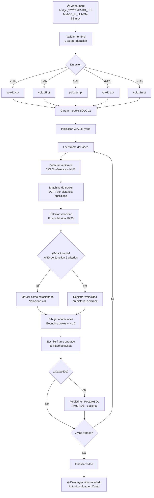
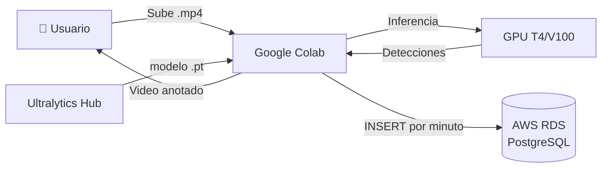

<!-- context: VAAET/Docs/DDS.md — Documento de Diseño de Software del sistema VAAET.
Complementa PRD.md (requisitos) y se implementa en vaaet.ipynb (notebook único).
Las decisiones de diseño están documentadas en Docs/adr/. -->

# Documento de Diseño de Software (DDS): Sistema VAAET

---

## 1. Arquitectura del Sistema

La arquitectura de VAAET está diseñada como un **pipeline de procesamiento secuencial**, encapsulado en un entorno de Jupyter Notebook para facilitar la reproducibilidad y la inspección de resultados intermedios. Esta arquitectura es **modular**, centrada en la clase `VAAETHybrid`, lo que permite un flujo de datos claro desde la ingesta del video hasta la generación de resultados analíticos.

Consultar [ADR-001](adr/ADR-001-notebook-monolitico.md) y [ADR-007](adr/ADR-007-google-colab-como-runtime.md) para el razonamiento detrás de la arquitectura de notebook monolítico en Google Colab.

### Diagrama de Flujo Lógico de Datos



Para diagramas adicionales, consultar el directorio [diagrams/](diagrams/).

### Arquitectura de Infraestructura



Consultar [diagrama detallado de arquitectura Colab+AWS](diagrams/colab-aws-architecture.md).

---

## 2. Diseño Detallado de Componentes y Flujos de Procesamiento

### 2.1. Flujo de Detección y Reconocimiento de Vehículos

**Objetivo:** Transformar los datos de píxeles brutos de cada fotograma en una lista estructurada de objetos vehiculares, cada uno con su posición, clase y una métrica de confianza.

* **Proceso Detallado y Técnico:**
    1.  **Ingesta y Pre-procesamiento del Frame:** Cada fotograma, leído por OpenCV como un array `numpy.ndarray` en formato BGR, es enviado al motor de inferencia. La librería `ultralytics` abstrae las operaciones de pre-procesamiento requeridas por la arquitectura YOLO, incluyendo la conversión del espacio de color (BGR a RGB), la normalización de los valores de píxeles (generalmente a un rango de [0, 1]) y el redimensionamiento del frame a la resolución de entrada para la cual el modelo fue entrenado (ej. 640x640), manteniendo la relación de aspecto y aplicando *padding* si es necesario.
    2.  **Inferencia de la Red Neuronal Convolucional (CNN):** La instancia del modelo `YOLO` procesa el tensor del frame pre-procesado. La arquitectura de YOLO, de tipo *single-shot detector*, realiza una única pasada por la red para predecir simultáneamente las cajas delimitadoras (*bounding boxes*) y las probabilidades de clase. El *backbone* de la red extrae características visuales, mientras que el *head* de la red genera un tensor de salida que codifica una grilla de predicciones sobre la imagen.
    3.  **Post-procesamiento y Filtrado (Non-Max Suppression):** El tensor de salida crudo es procesado para refinar las predicciones:
        * **Filtrado por Umbral de Confianza:** Se aplica un primer filtro vectorial para descartar todas las predicciones cuyo *confidence score* (la probabilidad de que una caja contenga un objeto) sea inferior al `confidence_threshold` configurado en `0.5`.
        * **Algoritmo Non-Max Suppression (NMS):** Para resolver el problema de detecciones múltiples para un mismo objeto, se aplica NMS. Este algoritmo agrupa las cajas superpuestas (basado en un umbral de **Intersection over Union - IoU**, configurado en `nms_threshold=0.4`) y, dentro de cada grupo, suprime todas las cajas excepto la que posee el mayor *confidence score*.
    4.  **Extracción de Datos Estructurados:** El resultado final del pipeline de detección es una lista limpia de objetos. Cada elemento de la lista representa un vehículo detectado y contiene: las coordenadas de su `bounding box` [x1, y1, x2, y2], la etiqueta de su clase predicha (ej. 'car') y su puntuación de confianza.

* **Librerías, Funciones y Técnicas Clave:**
    * **Librería `ultralytics`:** Proporciona la implementación de alto nivel del modelo YOLOv11. La invocación del objeto `YOLO()` es la función principal que encapsula todo el ciclo de vida de la inferencia, desde el pre-procesamiento hasta el NMS.
    * **Técnica `Deep Learning / CNN`:** YOLOv11 es el algoritmo de *deep learning* que realiza la tarea de detección de objetos.
    * **Técnica `Non-Max Suppression (NMS)`:** Algoritmo crítico para el post-procesamiento, que garantiza que cada objeto sea representado por una única y óptima caja delimitadora.

### 2.2. Flujo de Cálculo de Velocidad por Vehículo

**Objetivo:** Estimar la velocidad de cada vehículo de manera robusta, compensando las no linealidades de la perspectiva y la dinámica de la cámara.

* **Proceso Detallado y Técnico:**
    1.  **Mantenimiento del Historial de Trayectoria:** Para cada vehículo rastreado, el sistema utiliza una estructura `collections.deque` de tamaño fijo. Esta estructura de datos es altamente eficiente para almacenar las coordenadas del centroide `(cx, cy)` de las últimas `N` detecciones, permitiendo operaciones de inserción y eliminación en tiempo constante O(1).
    2.  **Compensación de Movimiento de Cámara (Estabilización Virtual):**
        * Se calcula el **Flujo Óptico** entre el fotograma actual y el anterior (en escala de grises) utilizando la función `cv2.calcOpticalFlowPyrLK`. Esta función implementa una versión piramidal del algoritmo de Lucas-Kanade, que es robusto a movimientos moderados.
        * El resultado es un conjunto de vectores de movimiento para puntos de interés en la escena. Se aplica un filtrado estadístico robusto (cálculo de la **mediana vectorial** con `numpy.median`) sobre estos vectores para estimar un único **vector de movimiento global**, que representa la moción de la cámara (paneo, vibración).
        * Este vector global **se resta vectorialmente** del vector de desplazamiento del vehículo. Esta operación, realizada con `numpy`, aísla el movimiento intrínseco del vehículo, un paso crítico para la precisión en cámaras no estáticas.
    3.  **Cálculo de Desplazamiento y Corrección de Perspectiva:**
        * Se calcula el desplazamiento euclidiano acumulado en el espacio de píxeles a partir de la trayectoria compensada.
        * Este desplazamiento se mapea al espacio real mediante la función `get_perspective_factor`. Esta función aplica un factor de escala no lineal que es función de la coordenada `y` del vehículo. Esto actúa como una **aproximación a una matriz de homografía**, pero con la flexibilidad de adaptarse dinámicamente a cambios de zoom que alteran la perspectiva verticalmente.
    4.  **Cálculo de Velocidad y Fusión con Modelo de Refinamiento:**
        * La distancia estimada en metros se divide por el intervalo de tiempo (`Δt`, derivado del FPS del video) para obtener una velocidad inicial en km/h.
        * Esta velocidad, junto a un vector de características extraídas del movimiento (como la varianza de la posición, la magnitud del desplazamiento, etc.), se introduce en un modelo `MLPRegressor` de **Scikit-learn**.
        * La velocidad final es una **combinación ponderada convexa** (70% del cálculo físico, 30% de la predicción del MLP). Este paso de **fusión de datos** utiliza el modelo de ML para suavizar outliers y corregir no linealidades que el modelo físico no captura, resultando en una estimación más estable.

* **Librerías, Funciones y Técnicas Clave:**
    * **`OpenCV`:** `cv2.calcOpticalFlowPyrLK()` para la implementación del algoritmo de Lucas-Kanade.
    * **`NumPy`:** Utilizado para todas las operaciones vectoriales, incluyendo la sustracción de vectores, cálculos de normas (distancias euclidianas) y estadísticas como `numpy.median` y `numpy.std`.
    * **`Scikit-learn`:** `MLPRegressor` para el refinamiento de la velocidad.
    * **Técnica `Flujo Óptico`:** Para la estimación y compensación del movimiento de la cámara.
    * **Técnica `Fusión de Datos (Data Fusion)`:** Combinación de un modelo basado en física (desplazamiento) con un modelo basado en datos (MLP) para mejorar la robustez y precisión.

### 2.3. Flujo de Detección de Vehículos Estacionados

**Objetivo:** Clasificar de manera fiable los vehículos detenidos, implementando una lógica de alta precisión (pocos falsos positivos) para no clasificar erróneamente el tráfico lento como estacionado.

* **Proceso Detallado y Técnico (`is_stationary`):**
    1.  **Requisito de Ventana Temporal Mínima:** El algoritmo solo se activa si el historial de trayectoria del vehículo (`deque`) supera un umbral de `min_stationary_observation` (ej. 150 frames). Este requisito previene decisiones prematuras sobre vehículos que acaban de entrar en la escena o se detienen brevemente.
    2.  **Análisis Estadístico de la Trayectoria:** Se trata la secuencia de coordenadas `(cx, cy)` como una serie temporal bivariada y se calculan varias métricas estadísticas:
        * **Varianza de Posición:** Se calcula la desviación estándar (`numpy.std`) de las coordenadas `x` e `y`. Una varianza cercana a cero indica que el vehículo ha oscilado mínimamente alrededor de un punto central.
        * **Desplazamiento Total:** Se calcula la distancia euclidiana entre el primer y el último punto de la ventana de observación. Este valor debe ser inferior a un umbral de píxeles muy bajo, indicando que no hubo un desplazamiento neto significativo.
        * **Movimiento Inter-Frame Máximo y Promedio:** Se calcula la distancia recorrida entre cada par de fotogramas consecutivos. Tanto el promedio (`numpy.mean`) como el máximo (`numpy.max`) de estas distancias deben estar por debajo de umbrales estrictos. El control del máximo es clave para descartar tracks con "saltos" o errores momentáneos.
    3.  **Criterio de Decisión Lógico:** Un vehículo se clasifica como estacionado **si y solo si** todos los criterios estadísticos anteriores se cumplen simultáneamente. Esta conjunción lógica (`AND`) hace que el clasificador sea **"ultra-conservador"**, garantizando una alta precisión a costa de una posible menor exhaustividad (recall), lo cual es el comportamiento deseado para esta funcionalidad.

* **Librerías, Funciones y Técnicas Clave:**
    * **`NumPy`:** Es la librería central, utilizada para los cálculos estadísticos: `numpy.std`, `numpy.mean`, `numpy.max`, `numpy.sqrt`.
    * **Técnica `Análisis Estadístico de Series Temporales`:** El enfoque fundamental para la clasificación, basado en las propiedades estadísticas de la trayectoria.

### 2.4. Estrategias para Reducir el Margen de Error en Entornos Dinámicos

* **Compensación de Movimiento de Cámara (Flujo Óptico):** Es la principal estrategia contra la no estacionalidad de la cámara. Al modelar y sustraer el egomovimiento de la cámara, el sistema aísla el movimiento real de los objetos, una condición *sine qua non* para la precisión en la velocidad en el entorno de las cámaras SISE.
* **Corrección de Perspectiva Adaptativa:** El uso de un factor de escala dinámico basado en la coordenada `y` proporciona una **calibración implícita y flexible**, superior a una matriz de homografía estática en escenarios con zoom variable.
* **Filtrado de Velocidades por Plausibilidad Física:** El uso de `speed_limits` como un **filtro a posteriori** elimina outliers evidentes que pueden surgir de errores de tracking (ej. un cambio de ID momentáneo). Esto previene la contaminación de las métricas agregadas como la velocidad promedio.
* **Suavizado Temporal de la Velocidad Promedio:** La implementación de una **media móvil ponderada** introduce una inercia temporal en la velocidad promedio. Esto actúa como un **filtro paso bajo**, eliminando el ruido de alta frecuencia (fluctuaciones momentáneas) y reflejando de manera más fiel las tendencias reales del flujo de tráfico.

---

## 3. Diseño de Base de Datos

Consultar [ADR-005](adr/ADR-005-postgresql-aws-rds.md) para el razonamiento de PostgreSQL sobre SQLite.

### Esquema

```sql
CREATE TABLE IF NOT EXISTS traffic_data (
    id SERIAL PRIMARY KEY,
    clip_id TEXT NOT NULL,
    record_time TIMESTAMP NOT NULL,
    avg_speed NUMERIC(5,2) NOT NULL,
    count_car INTEGER NOT NULL,
    count_truck INTEGER NOT NULL,
    count_bus INTEGER NOT NULL,
    count_motorcycle INTEGER NOT NULL,
    count_bicycle INTEGER NOT NULL,
    total_vehicles INTEGER NOT NULL,
    UNIQUE (clip_id, record_time)
);
```

Consultar [diagrama ERD](diagrams/erd.md) para detalle visual.

### Patrón de Conexión

- **Librería**: `psycopg2-binary`
- **Frecuencia de escritura**: Un INSERT cada 60 segundos de video procesado
- **Connection pooling**: No implementado — cada escritura abre y cierra conexión
- **Manejo de fallos**: Degradación silenciosa — si la conexión falla, el procesamiento continúa sin persistencia
- **Credenciales**: Variables de entorno (`DB_HOST`, `DB_PORT`, `DB_NAME`, `DB_USER`, `DB_PASSWORD`) o input via `getpass`

### Funciones de BD (Cell 1)

| Función | Responsabilidad |
|---|---|
| `configure_database()` | Solicita credenciales al usuario (env vars o getpass) |
| `create_table_if_not_exists(db_config)` | Ejecuta CREATE TABLE IF NOT EXISTS |
| `save_to_database(db_config, data)` | INSERT de métricas por minuto |

---

## 4. Diseño Multi-Cámara

El sistema detecta automáticamente el layout de cámaras en el video y procesa cada ROI independientemente.

### Layouts Soportados

| Layout | Detección | ROIs |
|---|---|---|
| 1 cámara | Frame sin divisiones | Frame completo |
| 2 cámaras | División vertical central | Mitad izquierda + mitad derecha |
| 4 cámaras | División en cuadrantes | 4 cuadrantes independientes |

Consultar [diagrama multi-cámara](diagrams/multi-camera-layout.md) para detalle visual.

### Procesamiento por ROI

Cada ROI se procesa con su propia instancia de tracking, lo que significa:
- IDs de vehículos son independientes entre ROIs
- Las velocidades se calculan con la perspectiva de cada vista
- Las métricas agregadas combinan datos de todas las ROIs

---

## 5. Generador de Videos Sintéticos

El sistema incluye un generador de demos (Cells 8-9) que produce videos sintéticos realistas del puente para demostraciones de portfolio sin necesidad de footage real.

### Escenarios Disponibles

| Escenario | Descripción | Duración |
|---|---|---|
| `light` | Tráfico ligero, pocos vehículos | Configurable |
| `normal` | Flujo normal de tráfico | Configurable |
| `busy` | Tráfico denso, alta densidad | Configurable |
| `mixed` | Combinación de condiciones | Configurable |
| `stationary_test` | Vehículos detenidos para validar `is_stationary()` | Configurable |

### Distribución de Vehículos Generados

car: 65%, truck: 15%, bus: 8%, motorcycle: 10%, bicycle: 2%

---

## 6. Manejo de Errores

### Estrategia General

El sistema adopta una **degradación silenciosa**: los errores se capturan, se reportan al usuario via `print()` con emoji, y el procesamiento continúa cuando es posible.

### Tabla de Errores

| Componente | Error | Comportamiento |
|---|---|---|
| BD PostgreSQL | Conexión fallida | Continúa sin persistencia |
| BD PostgreSQL | INSERT fallido | Salta el minuto, continúa procesando |
| Optical Flow | Frame sin puntos de interés | Usa velocidad sin compensación de cámara |
| YOLO | Frame sin detecciones | Usa promedios históricos |
| Tracking | No match para detección | Crea nuevo track |
| MLP | Predicción fuera de [5, 100] | Usa solo velocidad física (100%) |
| Video | Frame corrupto | Salta al siguiente frame |
| Archivo | Nombre inválido | Aborta procesamiento (error fatal) |

### Patrones de Emoji

```
✅  Operación exitosa
⚠️  Advertencia (no fatal)
🔴  Error (recuperable o fatal)
📊  Resultado/métrica
🎬  Inicio/fin de procesamiento
📥  Descarga de archivo
```

---

## 7. Decisiones Arquitectónicas Relacionadas

| Decisión | ADR |
|---|---|
| Notebook monolítico | [ADR-001](adr/ADR-001-notebook-monolitico.md) |
| YOLO 11 adaptativo | [ADR-002](adr/ADR-002-yolo11-seleccion-adaptativa.md) |
| SORT vs DeepSORT | [ADR-003](adr/ADR-003-sort-sobre-deepsort.md) |
| MLP como suavizador | [ADR-004](adr/ADR-004-mlp-como-suavizador.md) |
| PostgreSQL AWS RDS | [ADR-005](adr/ADR-005-postgresql-aws-rds.md) |
| Estacionarios conservadores | [ADR-006](adr/ADR-006-deteccion-estacionarios-conservadora.md) |
| Google Colab runtime | [ADR-007](adr/ADR-007-google-colab-como-runtime.md) |