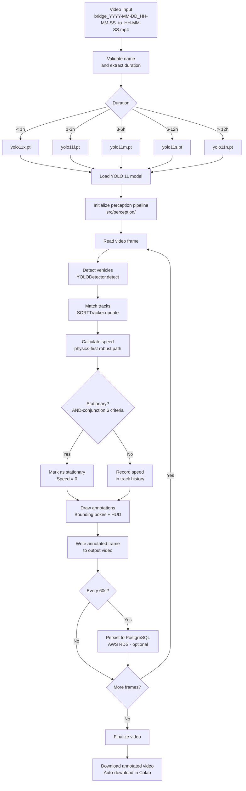
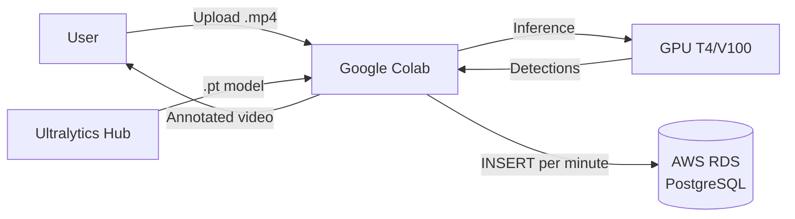

<!-- context: VAAET/docs/DDS.md — Software Design Document for the VAAET system.
Complements PRD.md (requirements). Module 0 is archived in archive/00_bootstrap/,
Module 1 in notebooks/01_data_prep/, Module 2 in notebooks/02_production/.
Decisions are in docs/adr/. -->

# Software Design Document (DDS): VAAET System

---

## 1. System Architecture

VAAET's architecture is designed as a **three-module sequential processing pipeline** with shared `src/` modules, encapsulated in Jupyter Notebook environments for reproducibility and intermediate result inspection. The architecture follows **SOLID, YAGNI, and KISS** principles with high cohesion and low coupling.

See [ADR-009](adr/ADR-009-modular-three-stage-architecture.md) for the rationale behind the modular three-stage architecture.

## Current Implementation Note (2026-03-13)

- `archive/00_bootstrap/` is frozen and retained only as historical context
- The active speed pipeline is physics-first: optical-flow compensation, perspective correction, reliability gates, and robust per-minute aggregation
- Optional MLP speed fusion exists in `src/perception/speed.py`, but `src/perception/pipeline.py` does not wire it by default
- `near_zero_motion` and `stationary_confirmed` are tracked as separate signals to avoid collapsing slow traffic into parked-vehicle logic
- `src/persistence.py` is the source of truth for the active PostgreSQL schema
- Notebook compilation and parity are automated; end-to-end Google Colab execution remains a manual smoke test

### Logical Data Flow Diagram



### Infrastructure Architecture



See [detailed Colab+AWS architecture diagram](diagrams/colab-aws-architecture.md).

---

## 2. Detailed Component Design and Processing Flows

### 2.1. Vehicle Detection and Recognition Flow

**Objective:** Transform raw pixel data from each frame into a structured list of vehicular objects with position, class, and confidence.

**Detailed Process:**

1. **Frame Ingestion and Pre-processing:** Each frame, read by OpenCV as a BGR `numpy.ndarray`, is sent to the inference engine. The `ultralytics` library abstracts pre-processing including color space conversion (BGR to RGB), pixel value normalization ([0, 1]), and resizing to the model's training resolution (e.g., 640x640) with aspect ratio preservation and padding.

2. **CNN Inference:** The `YOLO` model instance processes the pre-processed frame tensor. YOLO's single-shot detector architecture performs a single pass to simultaneously predict bounding boxes and class probabilities.

3. **Post-processing and Filtering (NMS):**
   - **Confidence threshold filter**: Discards predictions with confidence below `0.5`
   - **Non-Max Suppression (NMS)**: Groups overlapping boxes (IoU threshold `0.4`) and keeps only the highest-confidence box per group

4. **Structured Data Extraction:** The final output is a clean list of detected objects, each containing: bounding box coordinates `[x1, y1, x2, y2]`, predicted class label (e.g., 'car'), and confidence score.

**Key Libraries and Techniques:**
- **`ultralytics`**: High-level YOLO 11 implementation
- **Deep Learning / CNN**: Object detection algorithm
- **NMS**: Post-processing algorithm ensuring one box per object

### 2.2. Per-Vehicle Speed Calculation Flow

**Objective:** Robustly estimate each vehicle's speed under camera motion, perspective changes, and noisy tracks without overengineering the academic runtime.

**Detailed Process:**

1. **Trajectory History Maintenance:** Each track stores recent centroid coordinates in a fixed-size `collections.deque`, keeping the implementation simple and testable.

2. **Camera Motion Compensation:**
   - Optical Flow estimates global frame motion
   - The global motion vector is subtracted from per-vehicle displacement
   - Low tracking-ratio or recently recovered tracks are treated as lower-quality samples

3. **Physics-First Speed Estimation:**
   - Euclidean displacement is accumulated in pixel space over a short temporal window
   - `get_perspective_factor()` applies a zone-based scale correction tied to vehicle Y-position
   - Physical speed is computed from distance and FPS, then filtered by noise floor and per-type plausibility limits

4. **Reliability Gates and Robust Aggregation:**
   - Tracks with abrupt anomalies, weak flow support, or recovery after a gap can be rejected from minute-level speed summaries
   - Accepted per-track speeds are aggregated with `robust_speed_summary()` to suppress isolated spikes
   - Optional MLP fusion remains available in code, but it is not the default path used by `process_clip_telemetry()`

**Key Libraries and Techniques:**
- **OpenCV**: Optical Flow and video I/O
- **NumPy**: Vectorized displacement, norms, and robust statistics
- **Optical Flow**: Camera-motion compensation
- **Robust statistics**: Outlier rejection and trimmed aggregation

### 2.3. Stationary Vehicle Detection Flow

**Objective:** Separate slow traffic from genuinely stationary vehicles with conservative rules suitable for dynamic bridge footage.

**Process:**

1. **Two internal signals:** `is_near_zero_motion()` captures minimal movement; `TrackMotionStateTracker` confirms `stationary_confirmed` with hysteresis
2. **Trajectory statistics:** The detector evaluates total displacement, segment maxima, dispersion, and average frame motion over recent history
3. **Entry/exit hysteresis:** Stationary confirmation requires repeated low-motion evidence, while exit requires sustained movement or speed evidence
4. **Minute-level reporting:** The pipeline stores `near_zero_motion` and `stationary_confirmed` separately to avoid contaminating average speed with parked-vehicle decisions

See [ADR-006](adr/ADR-006-deteccion-estacionarios-conservadora.md) for the rationale.

### 2.4. Strategies for Reducing Error Margin in Dynamic Environments

- **Camera Motion Compensation (Optical Flow)**: Primary strategy against pan/tilt/zoom disturbances
- **Adaptive Perspective Correction**: Lightweight zone-based correction calibrated for the bridge
- **Physical Plausibility Filtering**: Rejects impossible or highly unstable speed estimates
- **Robust Minute Aggregation**: Suppresses spikes without erasing real low-speed signals
- **Quality Signals**: `speed_measurement_quality`, rejected samples, recovered tracks, near-zero motion, and stationary confirmation are fed forward into classification

---

## 3. Database Design

See [ADR-005](adr/ADR-005-postgresql-aws-rds.md) for PostgreSQL vs SQLite rationale.

### Schema

Three tables with FK chain: `traffic_data` (legacy source) -> `telemetry_raw` (active quality-aware telemetry) -> `traffic_classifications` (active predictions and optional validation metadata). `src/persistence.py` is the source of truth.

```sql
-- Module 0 legacy table
CREATE TABLE IF NOT EXISTS traffic_data (
    id SERIAL PRIMARY KEY,
    clip_id TEXT NOT NULL,
    record_time TIMESTAMP NOT NULL,
    avg_speed NUMERIC(5,2) NOT NULL,
    count_car INTEGER NOT NULL,
    count_truck INTEGER NOT NULL,
    count_bus INTEGER NOT NULL,
    count_motorcycle INTEGER NOT NULL,
    count_bicycle INTEGER NOT NULL,
    total_vehicles INTEGER NOT NULL,
    UNIQUE (clip_id, record_time)
);

-- Module 1/2 active telemetry
CREATE TABLE IF NOT EXISTS telemetry_raw (
    id SERIAL PRIMARY KEY,
    source_record_id INTEGER UNIQUE,
    clip_id TEXT,
    record_time TIMESTAMP NOT NULL,
    avg_speed NUMERIC(8,2),
    total_vehicles INTEGER,
    count_car INTEGER,
    count_truck INTEGER,
    count_bus INTEGER,
    count_motorcycle INTEGER,
    count_bicycle INTEGER,
    heavy_vehicle_ratio NUMERIC(8,4),
    delta_speed NUMERIC(8,2),
    delta_count INTEGER,
    transition_flag SMALLINT DEFAULT 0,
    speed_variance NUMERIC(8,4),
    cumulative_delta_speed NUMERIC(8,2),
    low_speed_persistence NUMERIC(8,2),
    speed_measurement_quality NUMERIC(8,4),
    near_zero_motion_ratio NUMERIC(8,4),
    stationary_confirmed_ratio NUMERIC(8,4),
    near_zero_motion_count INTEGER,
    stationary_confirmed_count INTEGER,
    rejected_speed_count INTEGER,
    recovered_track_count INTEGER,
    speed_sample_count INTEGER,
    data_origin TEXT,
    synthetic_scenario TEXT
);

-- Module 1/2 active classifications
CREATE TABLE IF NOT EXISTS traffic_classifications (
    id SERIAL PRIMARY KEY,
    telemetry_id INTEGER REFERENCES telemetry_raw(id),
    classified_at TIMESTAMP DEFAULT CURRENT_TIMESTAMP,
    traffic_state SMALLINT NOT NULL,
    state_label TEXT NOT NULL,
    confidence NUMERIC(8,4) NOT NULL,
    model_version TEXT NOT NULL,
    model_traffic_state SMALLINT,
    model_state_label TEXT,
    model_confidence NUMERIC(8,4),
    accident_rule_triggered BOOLEAN DEFAULT FALSE,
    accident_gate_applied BOOLEAN DEFAULT FALSE,
    accident_evidence_score NUMERIC(8,4),
    is_human_validated BOOLEAN DEFAULT FALSE,
    human_override_state SMALLINT,
    validated_at TIMESTAMP,
    UNIQUE (telemetry_id, model_version)
);
```

See [ERD diagram](diagrams/erd.md) and [Phase 2 ERD](diagrams/erd-phase2.md) for visual detail.

### Connection Pattern

- **Library**: SQLAlchemy + `psycopg2-binary` (via `src/db.py`)
- **Write frequency**: One INSERT every 60 seconds of processed video
- **Connection pooling**: Not implemented — each write opens/closes connection
- **Failure handling**: Silent degradation — processing continues without persistence
- **Credentials**: Environment variables (`DB_HOST`, `DB_PORT`, `DB_NAME`, `DB_USER`, `DB_PASSWORD`)

---

## 4. Multi-Camera Design

The system auto-detects camera layout and processes each ROI independently.

| Layout | Detection | ROIs |
|---|---|---|
| 1 camera | Undivided frame | Full frame |
| 2 cameras | Central vertical split | Left half + right half |
| 4 cameras | Quadrant split | 4 independent quadrants |

See [multi-camera diagram](diagrams/multi-camera-layout.md).

### Per-ROI Processing

Each ROI is processed with its own tracking instance:
- Vehicle IDs are independent across ROIs
- Speeds calculated with per-view perspective
- Aggregated metrics combine data from all ROIs

---

## 5. Synthetic Video Generator

Module 0 (archived) includes a synthetic generator that is preserved only as historical/bootstrap context, not as part of the active runtime.

| Scenario | Description |
|---|---|
| `light` | Light traffic, few vehicles |
| `normal` | Normal traffic flow |
| `busy` | Dense traffic |
| `mixed` | Mixed conditions |
| `stationary_test` | Stopped vehicles for `is_stationary()` validation |

Vehicle distribution: car 65%, truck 15%, bus 8%, motorcycle 10%, bicycle 2%.

---

## 6. Error Handling

### General Strategy

The system adopts **graceful degradation**: shared modules log concise contextual messages via the standard logging stack, while notebooks keep short user-facing status messages when appropriate. Processing continues when recovery is safe.

| Component | Error | Behavior |
|---|---|---|
| PostgreSQL | Connection failure | Continues without persistence |
| PostgreSQL | INSERT failure | Skips the minute, continues |
| Optical Flow | No feature points | Uses speed without camera compensation |
| YOLO | No detections | Uses historical averages |
| Tracking | No match | Creates new track |
| Optional MLP fusion | Prediction outside valid range | Falls back to physics-only speed |
| Video | Corrupt frame | Skips to next frame |
| File | Invalid name | Aborts processing (fatal error) |

### Emoji Patterns

```
✅  Successful operation
⚠️  Warning (non-fatal)
🔴  Error (recoverable or fatal)
📊  Result/metric
🎬  Processing start/end
📥  File download
```

---

## 7. Related Architecture Decisions

| Decision | ADR | Status |
|---|---|---|
| Modular three-stage architecture | [ADR-009](adr/ADR-009-modular-three-stage-architecture.md) | **Active** |
| TF/Keras traffic classification | [ADR-008](adr/ADR-008-tensorflow-keras-traffic-classifier.md) | Active |
| Monolithic notebook | [ADR-001](adr/ADR-001-notebook-monolitico.md) | Superseded by ADR-009 |
| YOLO 11 adaptive | [ADR-002](adr/ADR-002-yolo11-seleccion-adaptativa.md) | Superseded by ADR-009 |
| SORT vs DeepSORT | [ADR-003](adr/ADR-003-sort-sobre-deepsort.md) | Superseded by ADR-009 |
| MLP as smoother | [ADR-004](adr/ADR-004-mlp-como-suavizador.md) | Superseded by ADR-009 |
| PostgreSQL AWS RDS | [ADR-005](adr/ADR-005-postgresql-aws-rds.md) | Superseded by ADR-009 |
| Conservative stationary detection | [ADR-006](adr/ADR-006-deteccion-estacionarios-conservadora.md) | Superseded by ADR-009 |
| Google Colab runtime | [ADR-007](adr/ADR-007-google-colab-como-runtime.md) | Superseded by ADR-009 |

---

## 8. Intelligence Layer (Modules 1 & 2)

Modules 1 and 2 transform raw telemetry from `traffic_data` into traffic state classifications. Module 1 trains the classifier; Module 2 applies it in production with a feedback loop.

See [ADR-008](adr/ADR-008-tensorflow-keras-traffic-classifier.md) for the full rationale.

### 8.1 Classifier Architecture

Tabular MLP with TensorFlow/Keras `Sequential`, designed to evolve to LSTM in a future phase.

See [intelligence pipeline diagram](diagrams/intelligence-pipeline.md).

```
Input(14 features)
  -> Dense(64, relu) -> BatchNormalization -> Dropout(0.3)
  -> Dense(32, relu) -> BatchNormalization -> Dropout(0.2)
  -> Dense(n_classes, softmax)
```

- **Optimizer**: Adam
- **Loss**: Sparse Categorical Crossentropy
- **Callbacks**: EarlyStopping(patience=15), ReduceLROnPlateau(patience=5, factor=0.5)
- **Seed**: 42 (reproducibility)

### 8.2 Feature Engineering

| Feature | Formula / Source | Type | Justification |
|---|---|---|---|
| `avg_speed` | Direct from `traffic_data` | NUMERIC(5,2) | Primary flow indicator |
| `total_vehicles` | Direct | INTEGER | Absolute volume |
| `count_car` ... `count_bicycle` | Direct (5 fields) | INTEGER | Vehicular composition |
| `heavy_vehicle_ratio` | `(truck+bus)/total.clip(1)` | NUMERIC(5,4) | Heavy vehicle flow impact |
| `delta_speed` | `avg_speed.diff()` | NUMERIC(6,2) | Acceleration/deceleration |
| `delta_count` | `total_vehicles.diff()` | INTEGER | Volume change rate |
| `transition_flag` | `abs(delta_speed)>10 AND abs(delta_count)>5` | SMALLINT | Simultaneous abrupt change |
| `speed_variance` | `avg_speed.rolling(5).std()` | NUMERIC(6,2) | Flow stability |
| `hour_of_day` | `record_time.dt.hour` | SMALLINT | Circadian pattern |
| `weather_condition` | Proxy by hour (nocturnal=1) | SMALLINT | Simulated environmental condition |

### 8.3 Auto-Labeling

Engineering rules that assign states as ground truth proxy. Evaluation order: severity first.

| State | Code | Conditions |
|---|---|---|
| Accident | 3 | `avg_speed < 2` AND `delta_speed < -20` AND 3+ consecutive records |
| Congested | 2 | `avg_speed < 5` AND `total_vehicles > 25` AND 2+ consecutive records |
| Reduced | 1 | `avg_speed in [5, 40]` AND `total_vehicles in [15, 25]` |
| Normal | 0 | Everything else (default) |

### 8.4 Training

- **Scaling**: StandardScaler fit on training, transform on both sets
- **Partition**: 80/20 stratified by class (seed=42)
- **Balancing**: SMOTE on training set only (adaptive k_neighbors)
- **Target metric**: F1-macro >= 0.85

### 8.5 Persistence Schema

Two tables with FK chain: `traffic_data` -> `telemetry_raw` -> `traffic_classifications`.

See [Phase 2 ERD diagram](diagrams/erd-phase2.md) for visual detail.

**HITL (Human-in-the-Loop) fields** in `traffic_classifications`:
- `is_human_validated`: Boolean, default FALSE
- `human_override_state`: State corrected by SISE operator
- `validated_at`: Validation timestamp

Designed for the HITL feedback loop in Module 2; Module 1 records are all automatic.
