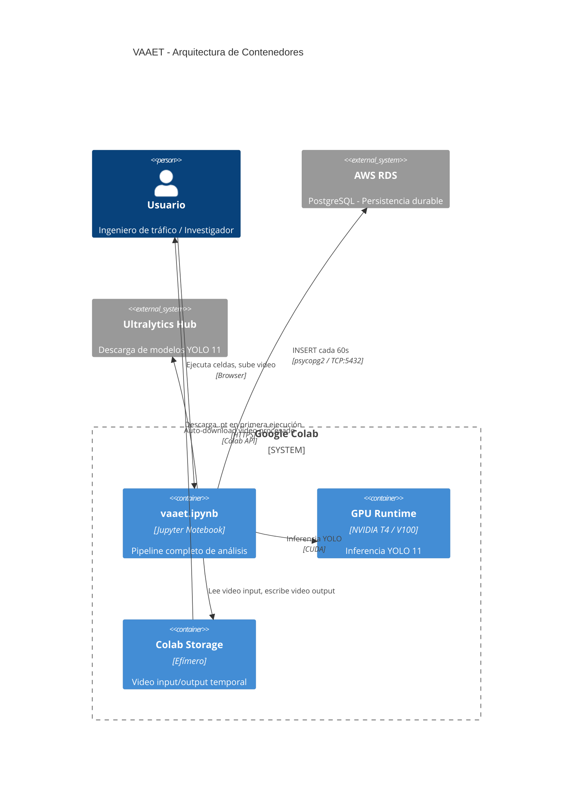
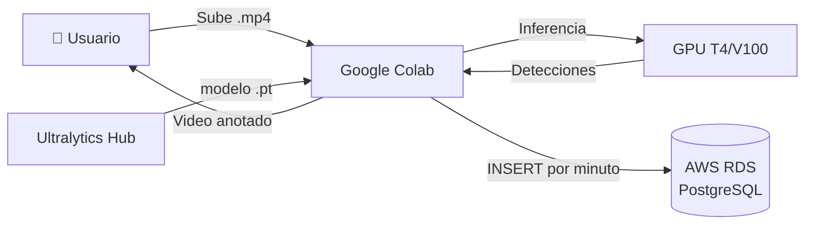

<!-- context: VAAET/Docs/diagrams/colab-aws-architecture.md — Diagrama C4 de contenedores.
Referenciado por DDS.md, AGENTS.md, ADR-005, ADR-007. -->

# Arquitectura Colab + AWS RDS

Diagrama de contenedores mostrando la infraestructura de ejecución.

## Flujo de Datos

## Notas de Seguridad

- Las credenciales de RDS se obtienen via **variables de entorno** (`DB_HOST`, `DB_PORT`, `DB_NAME`, `DB_USER`, `DB_PASSWORD`) o **`getpass`** interactivo
- Nunca se imprimen credenciales en outputs de celdas
- La conexión a RDS usa el puerto estándar 5432 sin SSL (pendiente como mejora)
- El almacenamiento de Colab es efímero — los videos se pierden al cerrar la sesión
