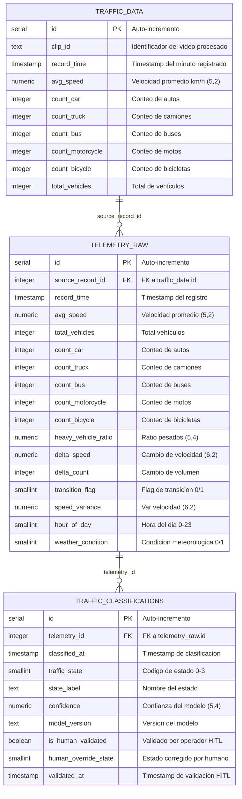

<!-- context: VAAET/Docs/diagrams/erd-phase2.md — Diagrama ERD completo con las 3 tablas.
Referenciado por DDS.md §8, ADR-008, DATA_LINEAGE.md §6. -->

# Esquema de Base de Datos — Etapa 1 + Etapa 2

Tres tablas con FK chain: `traffic_data` → `telemetry_raw` → `traffic_classifications`.

## Constraints

### telemetry_raw
- **PK**: `id` (auto-increment)
- **FK**: `source_record_id` → `traffic_data(id)`
- **Unique**: `(source_record_id)` — un feature set por registro de telemetría

### traffic_classifications
- **PK**: `id` (auto-increment)
- **FK**: `telemetry_id` → `telemetry_raw(id)`
- **Unique**: `(telemetry_id, model_version)` — una clasificación por modelo por registro

## Campos HITL (Human-in-the-Loop)

Diseñados para Fase 2 futura. En Fase 1 todos los registros tienen:
- `is_human_validated = FALSE`
- `human_override_state = NULL`
- `validated_at = NULL`

Cuando un operador SISE valide una clasificación, se actualizarán estos campos.
