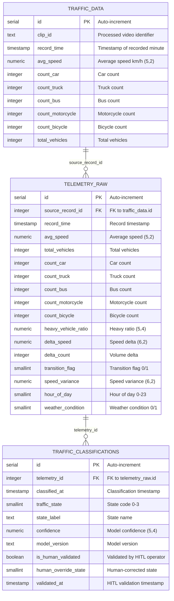

<!-- context: VAAET/docs/diagrams/erd-phase2.md — Complete ERD with all 3 tables.
Referenced by DDS.md, ADR-008, DATA_LINEAGE.md. -->

# Database Schema — Module 0 + Module 1

Three tables with FK chain: `traffic_data` → `telemetry_raw` → `traffic_classifications`.

## Constraints

### telemetry_raw
- **PK**: `id` (auto-increment)
- **FK**: `source_record_id` → `traffic_data(id)`
- **Unique**: `(source_record_id)` — one feature set per telemetry record

### traffic_classifications
- **PK**: `id` (auto-increment)
- **FK**: `telemetry_id` → `telemetry_raw(id)`
- **Unique**: `(telemetry_id, model_version)` — one classification per model per record

## HITL (Human-in-the-Loop) Fields

Designed for Module 2 feedback loop. Initially all records have:
- `is_human_validated = FALSE`
- `human_override_state = NULL`
- `validated_at = NULL`

When a SISE operator validates a classification, these fields will be updated.
