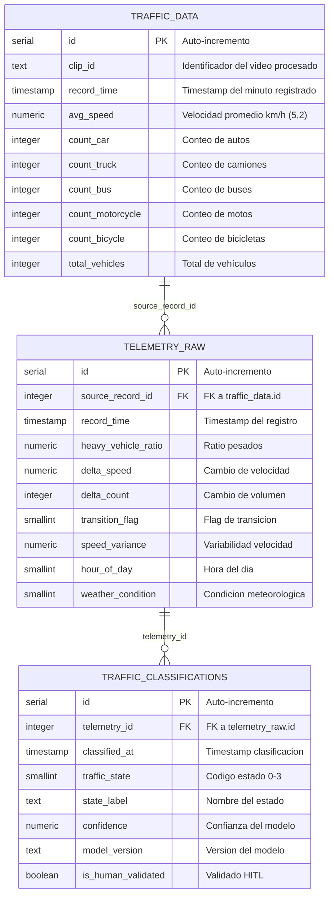

<!-- context: VAAET/Docs/diagrams/erd.md — Diagrama entidad-relación de la BD.
Referenciado por DDS.md, ADR-005, README.md. -->

# Esquema de Base de Datos (ERD)

Tabla `traffic_data` (Etapa 1) con extensión Phase 2: `telemetry_raw` y `traffic_classifications`.

Para el ERD completo con las 3 tablas, ver [erd-phase2.md](erd-phase2.md).



## Constraints

- **Primary Key**: `id` (auto-increment)
- **Unique**: `(clip_id, record_time)` — previene duplicados si se re-procesa el mismo video
- **Not Null**: `clip_id`, `record_time`, `avg_speed`, todos los conteos

## Patrón de Escritura

- **Frecuencia**: Un INSERT cada 60 segundos de video procesado
- **Conexión**: Abre y cierra por cada escritura (sin connection pooling)
- **Fallo**: Si la conexión falla, el sistema continúa sin persistencia (degradación silenciosa)

## Formato de `clip_id`

Derivado del nombre del archivo de video:
```
bridge_2026-03-06_08-00-00_to_09-00-00
```
