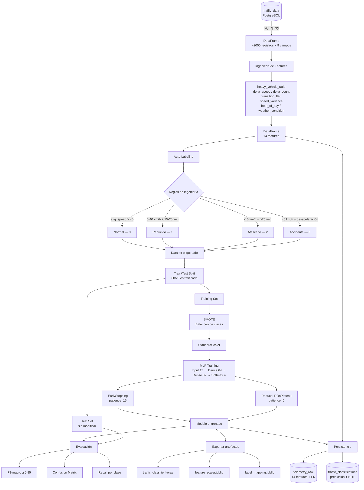

<!-- context: VAAET/Docs/diagrams/intelligence-pipeline.md — Pipeline de la Etapa 2 (Inteligencia).
Referenciado por DDS.md §8, ADR-008, notebook 02_traffic_state_classifier.ipynb. -->

# Pipeline de Inteligencia — Etapa 2

Flujo completo desde la telemetría de Etapa 1 hasta la clasificación de estado de tráfico y persistencia.

## Artefactos Generados

| Artefacto | Ruta | Propósito |
|---|---|---|
| Modelo Keras | `models/intelligence/traffic_classifier.keras` | Clasificador entrenado |
| Scaler | `models/intelligence/feature_scaler.joblib` | Normalización para inferencia |
| Label mapping | `models/intelligence/label_mapping.joblib` | Mapeo código→nombre de estado |
| CSV features | `data/processed/traffic_telemetry.csv` | Dataset con features para reproducibilidad |
