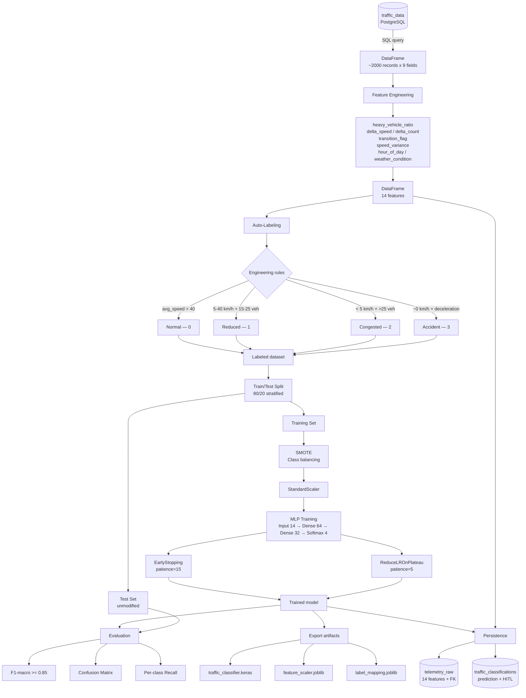

<!-- context: VAAET/docs/diagrams/intelligence-pipeline.md — Module 1 Intelligence Pipeline.
Referenced by DDS.md, ADR-008, notebook 01_data_prep/data_preparation.ipynb. -->

# Intelligence Pipeline — Module 1

Complete flow from Module 0 telemetry to traffic state classification and persistence.

## Generated Artifacts

| Artifact | Path | Purpose |
|---|---|---|
| Keras model | `models/intelligence/traffic_classifier.keras` | Trained classifier |
| Scaler | `models/intelligence/feature_scaler.joblib` | Normalization for inference |
| Label mapping | `models/intelligence/label_mapping.joblib` | Code-to-state-name mapping |
| Features CSV | `data/processed/traffic_telemetry.csv` | Feature dataset for reproducibility |
