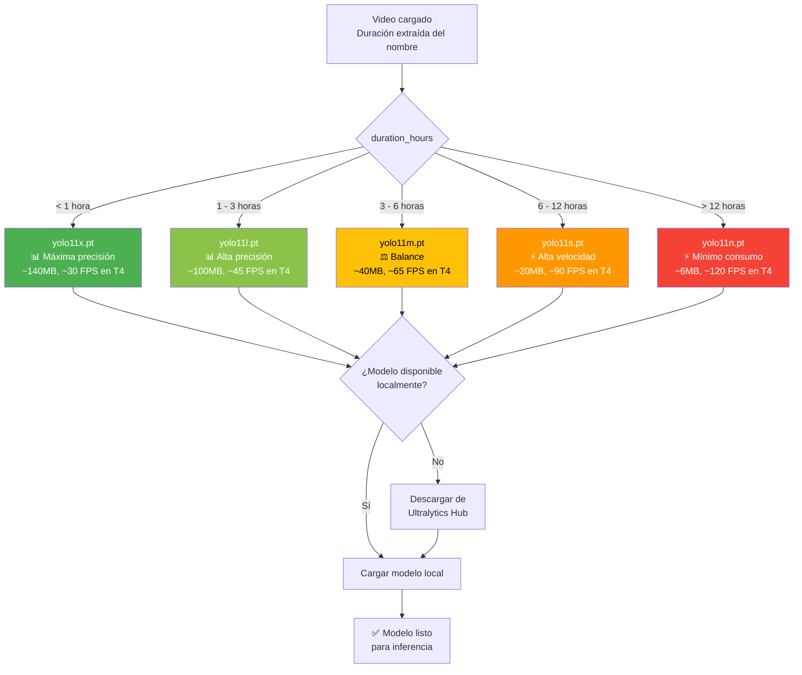

<!-- context: VAAET/Docs/diagrams/model-selection.md — Lógica de selección de modelo YOLO.
Referenciado por DDS.md, ADR-002, PRD.md. -->

# Selección Automática de Modelo YOLO 11

Diagrama de decisión de `select_optimal_model()` en Cell 4.



## Lógica (Cell 4)

```python
def select_optimal_model(duration_hours):
    if duration_hours < 1:     return "yolo11x.pt"
    elif duration_hours <= 3:  return "yolo11l.pt"
    elif duration_hours <= 6:  return "yolo11m.pt"
    elif duration_hours <= 12: return "yolo11s.pt"
    else:                      return "yolo11n.pt"
```

## Consideraciones

- La duración se extrae del **nombre del archivo**, no de los metadatos del video
- Si el nombre del modelo contiene "yolov11" (con 'v'), se normaliza automáticamente a "yolo11"
- FPS estimados en GPU T4 (Colab Free) — varían según resolución de video y carga del servidor
