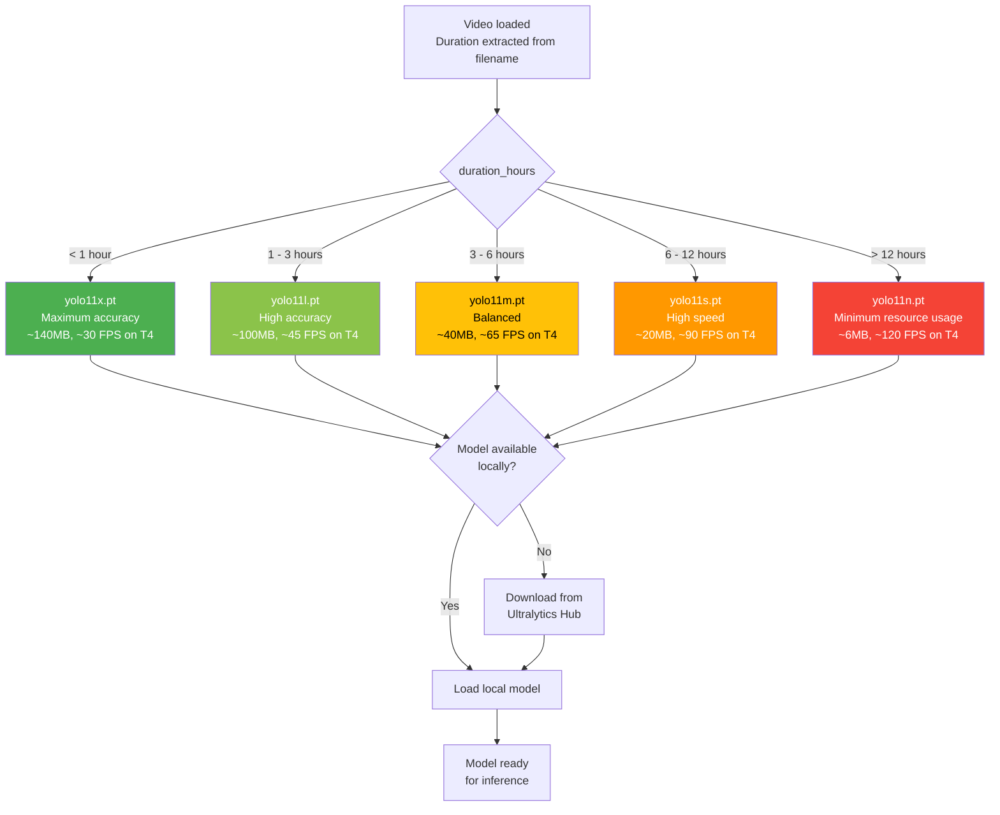

<!-- context: VAAET/docs/diagrams/model-selection.md — YOLO model selection logic.
Referenced by DDS.md, ADR-002, PRD.md. -->

# Automatic YOLO 11 Model Selection

Decision diagram for `select_optimal_model()` in `src/perception/detector.py`.



## Selection Logic

```python
def select_optimal_model(duration_hours: float) -> str:
    if duration_hours < 1:     return "yolo11x.pt"
    elif duration_hours <= 3:  return "yolo11l.pt"
    elif duration_hours <= 6:  return "yolo11m.pt"
    elif duration_hours <= 12: return "yolo11s.pt"
    else:                      return "yolo11n.pt"
```

## Notes

- Duration is extracted from the **filename**, not from video metadata
- If the model name contains "yolov11" (with 'v'), it is automatically normalized to "yolo11"
- Estimated FPS on T4 GPU (Colab Free) — varies by video resolution and server load
