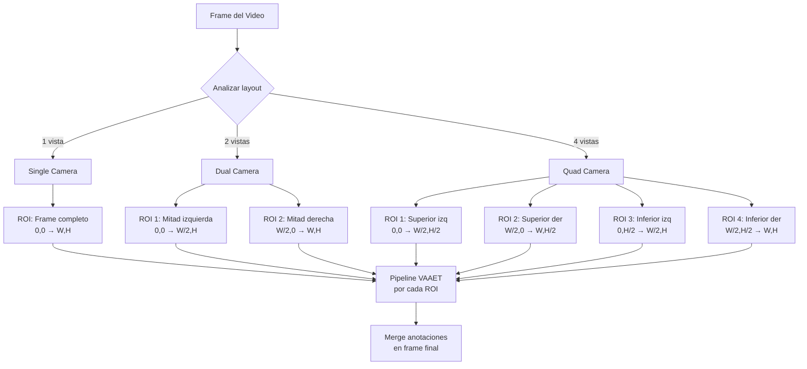
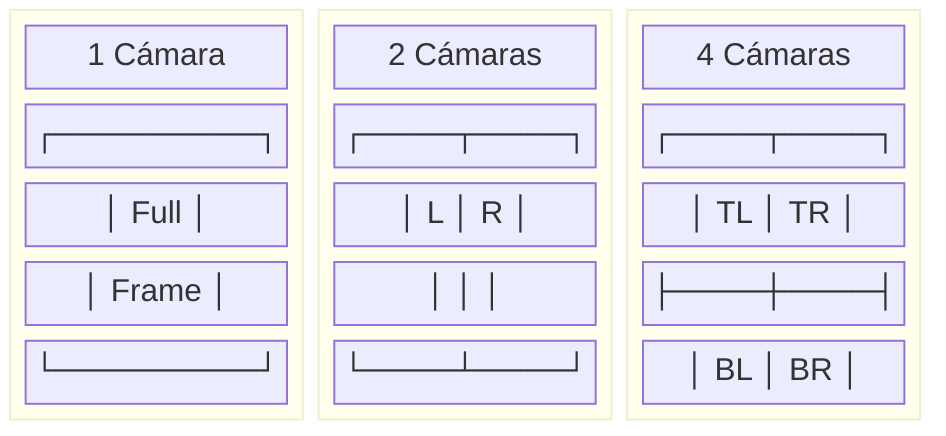

<!-- context: VAAET/Docs/diagrams/multi-camera-layout.md — Detección de layouts multi-cámara.
Referenciado por DDS.md, PRD.md requisito 5. -->

# Detección de Layout Multi-Cámara

El sistema auto-detecta si el video contiene 1, 2 o 4 vistas de cámara y procesa cada ROI independientemente.

## Layouts Visuales

## Notas

- La detección de layout se basa en análisis de bordes y áreas negras entre vistas
- Cada ROI se procesa independientemente con su propia instancia de tracking
- Las perspectivas pueden variar entre cámaras — las homografías se aplican por ROI
- Las métricas agregadas (velocidad promedio, conteos) combinan datos de todas las ROIs
