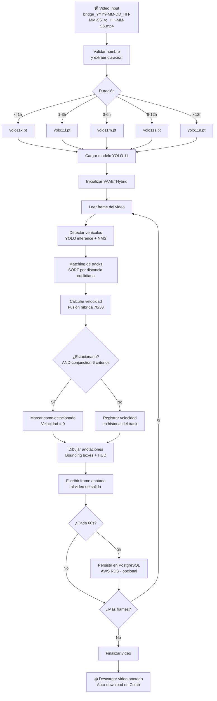

<!-- context: VAAET/Docs/diagrams/pipeline-flow.md — Diagrama principal del pipeline de procesamiento.
Referenciado por DDS.md §1, AGENTS.md, llms-full.txt. -->

# Pipeline de Procesamiento VAAET

Flujo completo de datos desde la ingesta del video hasta la salida anotada y persistencia.

