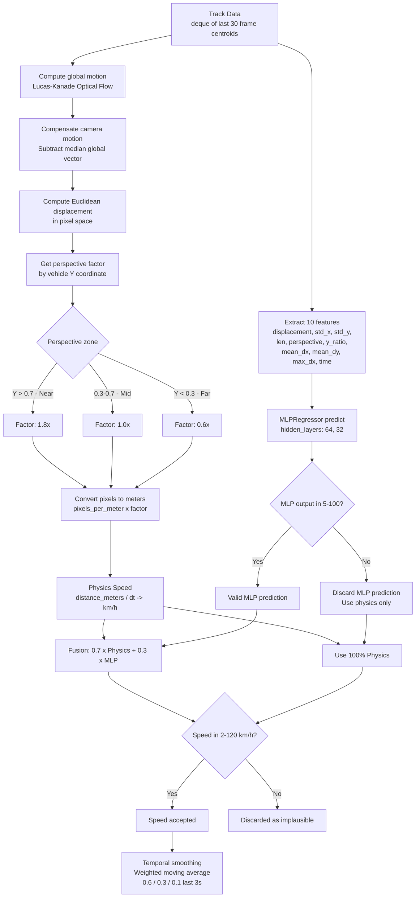

<!-- context: VAAET/docs/diagrams/speed-calculation.md — Detailed speed calculation flow.
Referenced by DDS.md, ADR-004. -->

# Hybrid Speed Calculation Flow

Detail of the `estimate_speed()` pipeline in `src/perception/speed.py`.

