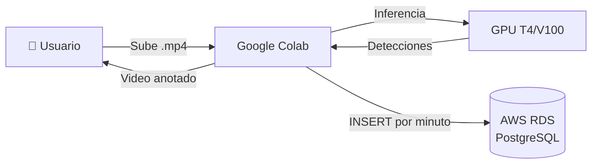

<!-- context: VAAET/README.md — Visión general del proyecto VAAET.
Para contexto agéntico ver AGENTS.md. Para diseño técnico ver Docs/DDS.md. -->

# VAAET - Puente General Manuel Belgrano (YOLO 11)

[](LICENSE)

Sistema avanzado de análisis de tránsito vehicular para el puente General Manuel Belgrano, optimizado para cámaras SISE dinámicas y videos de larga duración. Cumple 13 requisitos funcionales y de calidad, con selección automática de modelo YOLO 11, tracking persistente, cálculo híbrido de velocidad, multi-cámara, perspectiva, históricos, persistencia segura y outputs concisos.

## 🏗️ Arquitectura



- **Ejecución**: Google Colab (notebook monolítico, sin CI/CD)
- **Persistencia**: PostgreSQL en AWS RDS (opcional)
- **Detección**: YOLO 11 con selección adaptativa de modelo por duración

## 📂 Estructura del Proyecto

```
vaaet/
├── vaaet.ipynb              # Todo el código (9 celdas)
├── README.md                # Este archivo
├── AGENTS.md                # Contexto para agentes de IA
├── CONTRIBUTING.md          # Guía de contribución
├── CHANGELOG.md             # Historial de cambios
├── LICENSE                  # MIT
├── requirements.txt         # Dependencias
├── llms.txt                 # Índice para agentes RAG
├── llms-full.txt            # Documentación completa para LLMs
├── .gitignore
└── Docs/
    ├── PRD.md               # Requisitos del producto
    ├── DDS.md               # Diseño de software
    ├── GUIA_USUARIO.md      # Guía de usuario
    ├── DATA_LINEAGE.md      # Linaje de datos
    ├── BIAS_AND_LIMITATIONS.md
    ├── KPIs/KPIs.md         # Métricas y validación
    ├── adr/                 # Decisiones arquitectónicas (7 ADRs)
    └── diagrams/            # Diagramas Mermaid (6 diagramas)
```

## 🚦 Requisitos clave implementados

1. **Carga de video**: Solo acepta archivos con formato `bridge_YYYY-MM-DD_HH-MM-SS_to_HH-MM-SS.mp4`.
2. **Selección automática de modelo YOLO 11**:
   - <1h: yolo11x.pt
   - 1-3h: yolo11l.pt
   - 3-6h: yolo11m.pt
   - 6-12h: yolo11s.pt
   - > 12h: yolo11n.pt
3. **Persistencia opcional**: Guarda datos válidos cada minuto en PostgreSQL AWS RDS (seguro, sin credenciales hardcode).
4. **Cálculo híbrido de velocidad**: Real + Optical Flow Farneback + CNN (suavizado), con límites por tipo y exclusión de estacionados.
5. **Multi-cámara**: Detección automática de layout (1, 2 o 4 vistas) y procesamiento por ROI.
6. **Perspectiva**: Homografías calibrables por layout, con carga externa opcional.
7. **Tracking persistente**: Asignación de IDs robustos con SORT ligero.
8. **Históricos**: Panel informativo y persistencia usan promedios recientes cuando no hay detecciones.
9. **Descarga automática**: Video procesado con overlays y métricas.
10. **Optimización Colab**: Frame skipping adaptativo, limpieza de memoria y soporte para entornos gratuitos/pro.
11. **Modularidad y robustez**: Código desacoplado, funciones auxiliares, logging y gestión de errores.
12. **Notebook compacto**: ~8–10 celdas claras y fáciles de seguir.
13. **Outputs claros**: Mensajes de éxito/error en cada paso.

## 📝 Uso paso a paso

1. **Ejecuta las celdas en orden** (no se ejecutan automáticamente):

   1. Autodiagnóstico YOLO 11 (verifica versión Ultralytics y descarga pesos yolo11 si faltan)
   2. Carga de dependencias y utilidades
   3. `load_and_validate_video()` (valida nombre y selecciona modelo por duración)
   4. `initialize_video_processing()`
   5. (Opcional) Ejecuta la celda de mejoras avanzadas (tracking y optical flow Farneback)
   6. Celda final: ejecuta `process_bridge_video()`

2. **Carga tu video** con el formato correcto. Si el nombre no cumple, el sistema aborta.

3. **Elige si deseas persistir en base de datos** una sola vez (usa variables de entorno DB_HOST, DB_PORT, DB_NAME, DB_USER, DB_PASSWORD si están definidas).

4. **Procesa el video**. El sistema detecta vehículos, calcula velocidades, excluye estacionados, adapta a multi-cámara y guarda resultados.

5. **Descarga automática** del video procesado al finalizar.

6. Nota: Si tus pesos se llaman “yolov11*.pt”, el sistema los normaliza automáticamente a “yolo11*.pt”.

## ⚡ Mejoras avanzadas

- **Tracking y Optical Flow**: Habilítalos ejecutando la celda de mejoras avanzadas.
- **Homografías externas**: Puedes cargar matrices calibradas desde un JSON externo.
- **Calibración rápida**: Incluida una utilidad para generar matrices y asignarlas manualmente.

## 🛡️ Seguridad

- Nunca expone credenciales en outputs.
- Persistencia solo si todas las variables de entorno están presentes.

## 🏗️ Contexto puente y cámaras

- 1700m longitud, 8.3m calzada, cámaras SISE a 60m, multi-vista, zoom, visión nocturna, etc.

## 🧩 Dependencias

- Python 3.8+
- ultralytics, opencv-python, numpy, scikit-learn, psycopg2-binary

Instala dependencias con:

```bash
pip install -r requirements.txt
```

O manualmente:

```bash
pip install ultralytics opencv-python numpy scikit-learn psycopg2-binary
```

## 📋 Esquema PostgreSQL esperado

```sql
CREATE TABLE IF NOT EXISTS traffic_data (
  id SERIAL PRIMARY KEY,
  clip_id TEXT NOT NULL,
  record_time TIMESTAMP NOT NULL,
  avg_speed NUMERIC(5,2) NOT NULL,
  count_car INTEGER NOT NULL,
  count_truck INTEGER NOT NULL,
  count_bus INTEGER NOT NULL,
  count_motorcycle INTEGER NOT NULL,
  count_bicycle INTEGER NOT NULL,
  total_vehicles INTEGER NOT NULL,
  UNIQUE (clip_id, record_time)
);
```

## 🎬 Demos Sintéticas

El sistema incluye un generador de videos sintéticos (Celdas 8-9) para ejecutar demos de portfolio sin necesidad de footage real del puente. Escenarios disponibles: light, normal, busy, mixed, stationary_test.

## 📚 Documentación

| Documento | Descripción |
|---|---|
| [Docs/PRD.md](Docs/PRD.md) | Requisitos del producto |
| [Docs/DDS.md](Docs/DDS.md) | Diseño de software y diagramas |
| [Docs/GUIA_USUARIO.md](Docs/GUIA_USUARIO.md) | Guía de usuario |
| [Docs/KPIs/KPIs.md](Docs/KPIs/KPIs.md) | Métricas y validación |
| [Docs/DATA_LINEAGE.md](Docs/DATA_LINEAGE.md) | Linaje de datos |
| [Docs/BIAS_AND_LIMITATIONS.md](Docs/BIAS_AND_LIMITATIONS.md) | Sesgos y limitaciones |
| [Docs/adr/](Docs/adr/) | Decisiones arquitectónicas (7 ADRs) |
| [Docs/diagrams/](Docs/diagrams/) | Diagramas Mermaid (6) |
| [AGENTS.md](AGENTS.md) | Contexto para agentes de IA |
| [CONTRIBUTING.md](CONTRIBUTING.md) | Guía de contribución |

## ❓ Soporte

Para calibración, integración avanzada o dudas, consulta el notebook, la [guía de usuario](Docs/GUIA_USUARIO.md) y los comentarios en cada celda.
