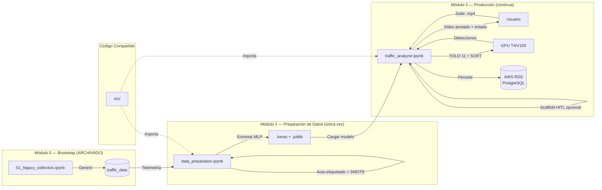

<!-- context: VAAET/README.md — Visión general del proyecto.
Para contexto de agentes de IA, ver AGENTS.md.
Para diseño técnico, ver docs/SAD.md. -->

# VAAET — Video Advanced Analysis of Traffic

[](LICENSE)
[](https://github.com/zgfnicolas/vaaet/actions)

Sistema avanzado de análisis vehicular para el **Puente General Manuel Belgrano** (Corrientes, Argentina), optimizado para cámaras de vigilancia dinámica SISE y video de larga duración. Pipeline de tres módulos: **bootstrap** (archivado), **preparación de datos** (entrenamiento único), y **producción** (YOLO 11 + telemetría de velocidad physics-first + clasificador MLP de estados del tráfico + scaffold HITL opcional).

## Arquitectura



- **Módulo 0 — Bootstrap (archivado)**: `archive/00_bootstrap/01_legacy_collection.ipynb` — Pipeline YOLO 11 histórico que generó `traffic_data`. **No se ejecuta nunca más.**
- **Módulo 1 — Preparación de Datos**: `notebooks/01_data_prep/data_preparation.ipynb` — Feature engineering + auto-etiquetado + SMOTE + entrenamiento MLP → exporta artefactos `.keras` y `.joblib`
- **Módulo 2 — Producción**: `notebooks/02_production/traffic_analyzer.ipynb` — YOLO 11 + SORT + estimación de velocidad physics-first + clasificador MLP entrenado + persistencia DB opcional + scaffold HITL experimental
- **Código compartido**: `src/` — Módulos Python reutilizables importados por los Módulos 1 y 2
- **Persistencia**: PostgreSQL en AWS RDS (opcional). 3 tablas: `traffic_data` (legado), `telemetry_raw` + `traffic_classifications` (activas)

## Estructura del Proyecto

```
vaaet/
├── archive/
│   └── 00_bootstrap/
│       ├── 01_legacy_collection.ipynb   # Módulo 0: Pipeline YOLO histórico (CONGELADO)
│       └── README.md                    # Explica el estado deprecado
├── notebooks/
│   ├── 01_data_prep/
│   │   └── data_preparation.ipynb       # Módulo 1: Feature eng. + entrenamiento de modelo
│   └── 02_production/
│       └── traffic_analyzer.ipynb       # Módulo 2: YOLO + clasificador + feedback
├── src/
│   ├── __init__.py
│   ├── calibration.py                   # Helpers de calibración manual por landmarks del puente
│   ├── classification.py               # Inferencia compartida + gate conservador de accidentes
│   ├── config.py                        # Fuente única de verdad: constantes, rutas, umbrales
│   ├── contracts.py                     # Contratos de datos tipados y validados
│   ├── dataset.py                       # Carga y validación de datasets
│   ├── db.py                            # Factory de engine SQLAlchemy, manejo de credenciales
│   ├── exceptions.py                    # Excepciones personalizadas
│   ├── features.py                      # Feature engineering + señales de calidad
│   ├── labeling.py                      # Reglas de auto-etiquetado (4 estados del tráfico)
│   ├── logging_utils.py                 # Utilidades de logging
│   ├── persistence.py                   # Persistencia DB opcional para Módulos 1 y 2
│   ├── reporting.py                     # Reportes y visualizaciones
│   ├── synthetic.py                     # Generación de datos sintéticos
│   ├── video.py                         # Utilidades de video I/O
│   └── perception/
│       ├── __init__.py
│       ├── detector.py                  # Wrapper de YOLODetector
│       ├── optical_flow.py              # Estimador de flujo óptico
│       ├── pipeline.py                  # Extracción de telemetría por minuto
│       ├── tracker.py                   # Wrapper de SORTTracker
│       └── speed.py                     # Estimación de velocidad basada en física
├── models/
│   ├── perception/                      # Pesos YOLO (descargados en runtime, gitignored)
│   └── intelligence/                    # Artefactos del Módulo 1 (.keras, .joblib, gitignored)
├── data/
│   ├── raw/                             # Backups de BD (gitignored)
│   ├── processed/                       # CSVs de features (gitignored)
│   └── samples/                         # Datos de ejemplo
├── scripts/
│   ├── convert_backup.py                # Conversión de backup PostgreSQL a CSV
│   └── evaluate_real_clips.py           # Evaluador offline de telemetría
├── tests/                               # 19 archivos de test, 2500+ líneas
├── docs/
│   ├── PRD.md                           # Requisitos del producto
│   ├── SAD.md                           # Arquitectura de software
│   ├── SRS.md                           # Especificación de requisitos
│   ├── MODEL_CARD.md                    # Model Card del clasificador MLP
│   ├── DATA_MODEL.md                    # Modelo de datos y diccionario
│   ├── USER_GUIDE.md                    # Guía de usuario
│   ├── DATA_LINEAGE.md                  # Linaje de datos
│   ├── BIAS_AND_LIMITATIONS.md          # Sesgos y limitaciones
│   ├── TEST_PLAN.md                     # Plan de pruebas
│   ├── DEPLOYMENT.md                    # Manual de despliegue
│   ├── USER_PERSONAS.md                 # Perfiles de usuario
│   ├── USE_CASES.md                     # Casos de uso del negocio
│   ├── RISK_MATRIX.md                   # Matriz de riesgos
│   ├── FEASIBILITY.md                   # Estudio de factibilidad
│   ├── SECURITY_POLICY.md               # Política de seguridad y privacidad
│   ├── BUSINESS_CANVAS.md               # Business Model Canvas
│   ├── INDEX.md                         # Índice maestro de documentación
│   ├── KPIs/KPIs.md                     # Métricas y validación
│   ├── adr/                             # Architecture Decision Records (10 ADRs)
│   └── diagrams/                        # Diagramas Mermaid
├── .github/workflows/ci.yml             # Pipeline CI con GitHub Actions
├── README.md                            # Este archivo
├── AGENTS.md                            # Contexto para agentes de IA
├── CONTRIBUTING.md                      # Guía de contribución
├── CHANGELOG.md                         # Historial de cambios
├── SECURITY.md                          # Política de seguridad
├── SUPPORT.md                           # Canales de soporte
├── LICENSE                              # MIT
├── pyproject.toml                       # Configuración del paquete Python
├── requirements.txt                     # Dependencias (compatibilidad)
├── .env.example                         # Template de variables de entorno
└── llms.txt                             # Resumen para RAG/LLMs
```

## Utilidades Manuales

- `scripts/convert_backup.py` — Helper local para convertir un `.backup` de PostgreSQL al CSV de respaldo utilizado por el Módulo 1 en Colab
- `scripts/evaluate_real_clips.py` — Evaluador offline para comparar exportaciones de telemetría baseline vs candidata en clips reales

## Inicio Rápido

### Prerrequisitos

- Python 3.8+ (o Google Colab con GPU gratuita)
- PostgreSQL en AWS RDS (opcional — el sistema degrada silenciosamente sin BD)

```bash
pip install -e ".[all]"
# O instalación clásica:
pip install -r requirements.txt
```

### Módulo 1 — Preparación de Datos (ejecutar una vez)

1. Abrir `notebooks/01_data_prep/data_preparation.ipynb` en Google Colab
2. Ejecutar las celdas requeridas en orden. Las celdas académicas opcionales son `7b` (validación cruzada), `7c` (exportación a Drive), y `8` (persistencia en BD)
3. Configurar credenciales de BD vía variables de entorno en la Celda 2 solo si se desea acceso a la base de datos (`DB_HOST`, `DB_PORT`, `DB_NAME`, `DB_USER`, `DB_PASSWORD`)
4. El sistema extrae telemetría de `traffic_data`, genera 19 features de calidad, auto-etiqueta 4 estados del tráfico, balancea clases con SMOTE, y entrena un clasificador MLP
5. **Artefactos exportados**: `models/intelligence/traffic_classifier.keras`, `feature_scaler.joblib`, `label_mapping.joblib`
6. **Métrica objetivo**: F1-macro ≥ 0.85

### Módulo 2 — Producción (continua)

1. Abrir `notebooks/02_production/traffic_analyzer.ipynb` en Google Colab
2. Ejecutar Celda 0 (setup del entorno) y Celda 1 (cargar modelo entrenado)
3. Subir un clip de video con formato `bridge_YYYY-MM-DD_HH-MM-SS_to_HH-MM-SS.mp4`
4. Ejecutar Celda 2 para procesamiento solo de telemetría, o Celda 2b para video anotado
5. Ejecutar Celda 3 para clasificar el estado del tráfico usando el MLP entrenado + gate conservador de accidentes
6. Ejecutar Celda 4 para persistir resultados en BD (opcional)
7. Celda 5 es un scaffold experimental de HITL/re-entrenamiento, no forma parte del flujo validado
8. Ejecutar Celda 6 para el dashboard de visualización

Los tests automatizados verifican paridad y compilación de notebooks, pero una ejecución end-to-end en Google Colab sigue siendo una validación manual.

## Características Principales

| Característica | Descripción |
|---|---|
| **Selección adaptativa de YOLO** | 5 variantes seleccionadas por duración del video (<1h: yolo11x, 1-3h: yolo11l, etc.) |
| **Estimación de velocidad physics-first** | Compensación de flujo óptico, corrección de perspectiva, filtros de plausibilidad, y agregación robusta por minuto |
| **4 estados del tráfico** | Normal, Reducido, Congestionado, Accidente — clasificados desde 19 features de telemetría con gate conservador de accidentes |
| **Scaffold HITL opcional** | Celda de re-entrenamiento orientada a investigación, no tratada como bucle productivo validado |
| **Soporte multi-cámara** | Detección automática de layouts de 1, 2 o 4 cámaras |
| **Degradación silenciosa** | Continúa sin BD si no está disponible; recurre a velocidad solo por física |
| **Validación estricta** | Formato de nombre de archivo de video obligatorio; velocidades fuera de rango descartadas |
| **19 features de calidad** | Incluyen señales de calidad de medición, movimiento cercano a cero, y estacionarios confirmados |

## Esquema PostgreSQL

### Legado — Telemetría Cruda (Módulo 0)

```sql
CREATE TABLE IF NOT EXISTS traffic_data (
  id SERIAL PRIMARY KEY,
  clip_id TEXT NOT NULL,
  record_time TIMESTAMP NOT NULL,
  avg_speed NUMERIC(5,2) NOT NULL,
  count_car INTEGER NOT NULL, count_truck INTEGER NOT NULL,
  count_bus INTEGER NOT NULL, count_motorcycle INTEGER NOT NULL,
  count_bicycle INTEGER NOT NULL, total_vehicles INTEGER NOT NULL,
  UNIQUE (clip_id, record_time)
);
```

### Activo — Features + Clasificación (Módulos 1 y 2)

```sql
CREATE TABLE IF NOT EXISTS telemetry_raw (
  id SERIAL PRIMARY KEY,
  source_record_id INTEGER UNIQUE,
  clip_id TEXT, record_time TIMESTAMP NOT NULL,
  avg_speed NUMERIC(8,2), total_vehicles INTEGER,
  count_car INTEGER, count_truck INTEGER, count_bus INTEGER,
  count_motorcycle INTEGER, count_bicycle INTEGER,
  heavy_vehicle_ratio NUMERIC(8,4),
  delta_speed NUMERIC(8,2), delta_count INTEGER,
  transition_flag SMALLINT DEFAULT 0, speed_variance NUMERIC(8,4),
  cumulative_delta_speed NUMERIC(8,2), low_speed_persistence NUMERIC(8,2),
  speed_measurement_quality NUMERIC(8,4),
  near_zero_motion_ratio NUMERIC(8,4), stationary_confirmed_ratio NUMERIC(8,4),
  near_zero_motion_count INTEGER, stationary_confirmed_count INTEGER,
  rejected_speed_count INTEGER, recovered_track_count INTEGER,
  speed_sample_count INTEGER, data_origin TEXT, synthetic_scenario TEXT
);

CREATE TABLE IF NOT EXISTS traffic_classifications (
  id SERIAL PRIMARY KEY,
  telemetry_id INTEGER REFERENCES telemetry_raw(id),
  classified_at TIMESTAMP DEFAULT CURRENT_TIMESTAMP,
  traffic_state SMALLINT NOT NULL, state_label TEXT NOT NULL,
  confidence NUMERIC(8,4) NOT NULL, model_version TEXT NOT NULL,
  model_traffic_state SMALLINT, model_state_label TEXT,
  model_confidence NUMERIC(8,4),
  accident_rule_triggered BOOLEAN DEFAULT FALSE,
  accident_gate_applied BOOLEAN DEFAULT FALSE,
  accident_evidence_score NUMERIC(8,4),
  is_human_validated BOOLEAN DEFAULT FALSE,
  human_override_state SMALLINT, validated_at TIMESTAMP,
  UNIQUE (telemetry_id, model_version)
);
```

## Seguridad

- Las credenciales **nunca** se exponen en outputs de celdas
- La persistencia en BD solo se activa cuando todas las variables de entorno están presentes
- No hay connection strings hardcodeados
- Ver [SECURITY.md](SECURITY.md) para la política completa

## Contexto del Puente y las Cámaras

- **Puente**: General Manuel Belgrano, 1700m de longitud, 8.3m de ancho de calzada
- **Cámaras**: SISE dinámicas a 60m de altura, con zoom, pan y visión nocturna
- **Tipos de vehículos**: auto, camión, colectivo, motocicleta, bicicleta
- **Velocidades típicas**: 40-80 km/h en flujo normal, 0-20 km/h en congestión

## Dependencias

**Núcleo**: numpy, pandas, sqlalchemy, psycopg2-binary, joblib

**Preparación de Datos (Módulo 1)**: tensorflow, scikit-learn, imbalanced-learn, matplotlib, seaborn

**Producción (Módulo 2)**: ultralytics, opencv-python, tensorflow, scikit-learn

```bash
pip install -e ".[all]"
```

## Validación Académica

- La calibración de velocidad es liviana y académica: landmarks del puente, cronometraje manual, y helpers de pseudo-ground-truth en `src/calibration.py`
- `near_zero_motion` y `stationary_confirmed` se trackean por separado para reducir falsos positivos de vehículos estacionarios en congestión
- `Accidente` es una clase rara y conservadora, soportada por reglas + episodios sintéticos hasta que existan suficientes casos reales
- El target de runtime es Google Colab Free, por lo que optimizaciones de infraestructura pesada están intencionalmente fuera de alcance

## Documentación

| Documento | Descripción |
|---|---|
| [docs/INDEX.md](docs/INDEX.md) | **Índice maestro** — mapa de toda la documentación |
| [docs/PRD.md](docs/PRD.md) | Requisitos del producto |
| [docs/SAD.md](docs/SAD.md) | Arquitectura de software |
| [docs/SRS.md](docs/SRS.md) | Especificación de requisitos |
| [docs/MODEL_CARD.md](docs/MODEL_CARD.md) | Model Card del clasificador MLP |
| [docs/DATA_MODEL.md](docs/DATA_MODEL.md) | Modelo de datos y diccionario |
| [docs/USER_GUIDE.md](docs/USER_GUIDE.md) | Guía de usuario |
| [docs/DATA_LINEAGE.md](docs/DATA_LINEAGE.md) | Linaje de datos |
| [docs/BIAS_AND_LIMITATIONS.md](docs/BIAS_AND_LIMITATIONS.md) | Sesgos y limitaciones |
| [docs/KPIs/KPIs.md](docs/KPIs/KPIs.md) | Métricas y validación |
| [docs/TEST_PLAN.md](docs/TEST_PLAN.md) | Plan de pruebas |
| [docs/adr/](docs/adr/) | Architecture Decision Records (10 ADRs) |
| [docs/diagrams/](docs/diagrams/) | Diagramas Mermaid |
| [AGENTS.md](AGENTS.md) | Contexto para agentes de IA |
| [CONTRIBUTING.md](CONTRIBUTING.md) | Guía de contribución |
| [SECURITY.md](SECURITY.md) | Política de seguridad |
| [SUPPORT.md](SUPPORT.md) | Canales de soporte |

## Demos Sintéticas

El Módulo 0 incluye un generador de video sintético (archivado) para demos de portfolio sin requerir metraje real del puente. Escenarios: light, normal, busy, mixed, stationary_test.

## Soporte

Para calibración, integración avanzada o consultas, ver la [guía de usuario](docs/USER_GUIDE.md), los notebooks, y los comentarios inline en cada celda. Para canales de soporte, ver [SUPPORT.md](SUPPORT.md).
