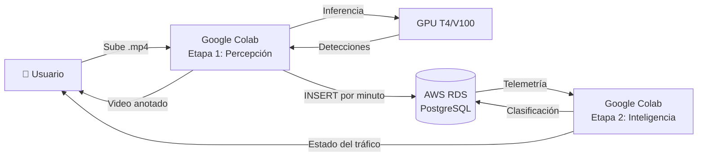

<!-- context: VAAET/README.md — Visión general del proyecto VAAET.
Para contexto agéntico ver AGENTS.md. Para diseño técnico ver Docs/DDS.md. -->

# VAAET - Puente General Manuel Belgrano (YOLO 11)

[](LICENSE)

Sistema avanzado de análisis de tránsito vehicular para el puente General Manuel Belgrano, optimizado para cámaras SISE dinámicas y videos de larga duración. Pipeline de dos etapas: **percepción** (YOLO 11 + tracking + velocidad) y **inteligencia** (TF/Keras clasificador de estado de tráfico).

## 🏗️ Arquitectura



- **Etapa 1 — Percepción**: YOLO 11 + OpenCV + SORT → telemetría cruda por minuto
- **Etapa 2 — Inteligencia**: TF/Keras MLP → clasificación de estado de tráfico (Normal/Reducido/Atascado/Accidente)
- **Persistencia**: PostgreSQL en AWS RDS (3 tablas: `traffic_data`, `telemetry_raw`, `traffic_classifications`)

## 📂 Estructura del Proyecto

```
vaaet/
├── notebooks/
│   ├── phase_1_perception/
│   │   └── 01_legacy_collection.ipynb   # Etapa 1: YOLO 11 + tracking + velocidad
│   └── phase_2_intelligence/
│       └── 02_traffic_state_classifier.ipynb  # Etapa 2: clasificación TF/Keras
├── models/
│   ├── perception/                      # Modelos YOLO (descargados en runtime)
│   └── intelligence/                    # Artefactos Etapa 2 (.keras, .joblib)
├── data/
│   ├── raw/                             # Backups de BD (gitignored)
│   ├── processed/                       # CSVs de features (gitignored)
│   └── samples/                         # Datos de ejemplo
├── src/utils/                           # Utilidades compartidas (futuro)
├── docs/
│   ├── PRD.md, DDS.md, GUIA_USUARIO.md
│   ├── DATA_LINEAGE.md, BIAS_AND_LIMITATIONS.md
│   ├── KPIs/KPIs.md
│   ├── adr/                             # Decisiones arquitectónicas (8 ADRs)
│   └── diagrams/                        # Diagramas Mermaid (8 diagramas)
├── README.md, AGENTS.md, CONTRIBUTING.md, CHANGELOG.md
├── requirements.txt, llms.txt, llms-full.txt
└── LICENSE
```

## 🚦 Requisitos clave implementados

1. **Carga de video**: Solo acepta archivos con formato `bridge_YYYY-MM-DD_HH-MM-SS_to_HH-MM-SS.mp4`.
2. **Selección automática de modelo YOLO 11**:
   - <1h: yolo11x.pt
   - 1-3h: yolo11l.pt
   - 3-6h: yolo11m.pt
   - 6-12h: yolo11s.pt
   - > 12h: yolo11n.pt
3. **Persistencia opcional**: Guarda datos válidos cada minuto en PostgreSQL AWS RDS (seguro, sin credenciales hardcode).
4. **Cálculo híbrido de velocidad**: Real + Optical Flow Farneback + CNN (suavizado), con límites por tipo y exclusión de estacionados.
5. **Multi-cámara**: Detección automática de layout (1, 2 o 4 vistas) y procesamiento por ROI.
6. **Perspectiva**: Homografías calibrables por layout, con carga externa opcional.
7. **Tracking persistente**: Asignación de IDs robustos con SORT ligero.
8. **Históricos**: Panel informativo y persistencia usan promedios recientes cuando no hay detecciones.
9. **Descarga automática**: Video procesado con overlays y métricas.
10. **Optimización Colab**: Frame skipping adaptativo, limpieza de memoria y soporte para entornos gratuitos/pro.
11. **Modularidad y robustez**: Código desacoplado, funciones auxiliares, logging y gestión de errores.
12. **Notebook compacto**: ~8–10 celdas claras y fáciles de seguir.
13. **Outputs claros**: Mensajes de éxito/error en cada paso.
14. **Clasificación de estado de tráfico**: TF/Keras MLP clasifica cada minuto en 4 estados (Normal/Reducido/Atascado/Accidente) a partir de 14 features de ingeniería.

## 📝 Uso paso a paso

1. **Ejecuta las celdas en orden** (no se ejecutan automáticamente):

   1. Autodiagnóstico YOLO 11 (verifica versión Ultralytics y descarga pesos yolo11 si faltan)
   2. Carga de dependencias y utilidades
   3. `load_and_validate_video()` (valida nombre y selecciona modelo por duración)
   4. `initialize_video_processing()`
   5. (Opcional) Ejecuta la celda de mejoras avanzadas (tracking y optical flow Farneback)
   6. Celda final: ejecuta `process_bridge_video()`

2. **Carga tu video** con el formato correcto. Si el nombre no cumple, el sistema aborta.

3. **Elige si deseas persistir en base de datos** una sola vez (usa variables de entorno DB_HOST, DB_PORT, DB_NAME, DB_USER, DB_PASSWORD si están definidas).

4. **Procesa el video**. El sistema detecta vehículos, calcula velocidades, excluye estacionados, adapta a multi-cámara y guarda resultados.

5. **Descarga automática** del video procesado al finalizar.

6. Nota: Si tus pesos se llaman “yolov11*.pt”, el sistema los normaliza automáticamente a “yolo11*.pt”.
### Etapa 2 — Clasificación de Estado de Tráfico

1. **Abre** `notebooks/phase_2_intelligence/02_traffic_state_classifier.ipynb` en Colab
2. **Ejecuta las 8 celdas de código en orden** — cada celda markdown explica qué hace la siguiente
3. **Configura la BD** (Cell 2) con las mismas credenciales de Etapa 1
4. El sistema extrae telemetría, genera 14 features, entrena un MLP y clasifica cada minuto
5. **Artefactos**: `models/intelligence/traffic_classifier.keras`, `feature_scaler.joblib`, `label_mapping.joblib`
6. **Métrica objetivo**: F1-macro ≥ 0.85
## ⚡ Mejoras avanzadas

- **Tracking y Optical Flow**: Habilítalos ejecutando la celda de mejoras avanzadas.
- **Homografías externas**: Puedes cargar matrices calibradas desde un JSON externo.
- **Calibración rápida**: Incluida una utilidad para generar matrices y asignarlas manualmente.

## 🛡️ Seguridad

- Nunca expone credenciales en outputs.
- Persistencia solo si todas las variables de entorno están presentes.

## 🏗️ Contexto puente y cámaras

- 1700m longitud, 8.3m calzada, cámaras SISE a 60m, multi-vista, zoom, visión nocturna, etc.

## 🧩 Dependencias

- Python 3.8+

**Etapa 1**: ultralytics, opencv-python, numpy, scikit-learn, psycopg2-binary

**Etapa 2**: tensorflow, pandas, sqlalchemy, imbalanced-learn, joblib, matplotlib, seaborn

Instala dependencias con:

```bash
pip install -r requirements.txt
```

## 📋 Esquema PostgreSQL esperado

### Etapa 1 — Telemetría cruda

```sql
CREATE TABLE IF NOT EXISTS traffic_data (
  id SERIAL PRIMARY KEY,
  clip_id TEXT NOT NULL,
  record_time TIMESTAMP NOT NULL,
  avg_speed NUMERIC(5,2) NOT NULL,
  count_car INTEGER NOT NULL,
  count_truck INTEGER NOT NULL,
  count_bus INTEGER NOT NULL,
  count_motorcycle INTEGER NOT NULL,
  count_bicycle INTEGER NOT NULL,
  total_vehicles INTEGER NOT NULL,
  UNIQUE (clip_id, record_time)
);
```

### Etapa 2 — Features + Clasificación

```sql
CREATE TABLE IF NOT EXISTS telemetry_raw (
  id SERIAL PRIMARY KEY,
  source_record_id INTEGER REFERENCES traffic_data(id),
  record_time TIMESTAMP NOT NULL,
  avg_speed NUMERIC(5,2),
  total_vehicles INTEGER,
  count_car INTEGER, count_truck INTEGER, count_bus INTEGER,
  count_motorcycle INTEGER, count_bicycle INTEGER,
  heavy_vehicle_ratio NUMERIC(5,4),
  delta_speed NUMERIC(6,2), delta_count INTEGER,
  transition_flag SMALLINT DEFAULT 0,
  speed_variance NUMERIC(6,2),
  hour_of_day SMALLINT, weather_condition SMALLINT DEFAULT 0,
  UNIQUE (source_record_id)
);

CREATE TABLE IF NOT EXISTS traffic_classifications (
  id SERIAL PRIMARY KEY,
  telemetry_id INTEGER REFERENCES telemetry_raw(id),
  classified_at TIMESTAMP DEFAULT CURRENT_TIMESTAMP,
  traffic_state SMALLINT NOT NULL,
  state_label TEXT NOT NULL,
  confidence NUMERIC(5,4) NOT NULL,
  model_version TEXT NOT NULL,
  is_human_validated BOOLEAN DEFAULT FALSE,
  human_override_state SMALLINT,
  validated_at TIMESTAMP,
  UNIQUE (telemetry_id, model_version)
);
```

## 🎬 Demos Sintéticas

El sistema incluye un generador de videos sintéticos (Celdas 8-9) para ejecutar demos de portfolio sin necesidad de footage real del puente. Escenarios disponibles: light, normal, busy, mixed, stationary_test.

## 📚 Documentación

| Documento | Descripción |
|---|---|
| [docs/PRD.md](docs/PRD.md) | Requisitos del producto |
| [docs/DDS.md](docs/DDS.md) | Diseño de software y diagramas |
| [docs/GUIA_USUARIO.md](docs/GUIA_USUARIO.md) | Guía de usuario |
| [docs/KPIs/KPIs.md](docs/KPIs/KPIs.md) | Métricas y validación |
| [docs/DATA_LINEAGE.md](docs/DATA_LINEAGE.md) | Linaje de datos |
| [docs/BIAS_AND_LIMITATIONS.md](docs/BIAS_AND_LIMITATIONS.md) | Sesgos y limitaciones |
| [docs/adr/](docs/adr/) | Decisiones arquitectónicas (8 ADRs) |
| [docs/diagrams/](docs/diagrams/) | Diagramas Mermaid (8) |
| [AGENTS.md](AGENTS.md) | Contexto para agentes de IA |
| [CONTRIBUTING.md](CONTRIBUTING.md) | Guía de contribución |

## ❓ Soporte

Para calibración, integración avanzada o dudas, consulta el notebook, la [guía de usuario](Docs/GUIA_USUARIO.md) y los comentarios en cada celda.
