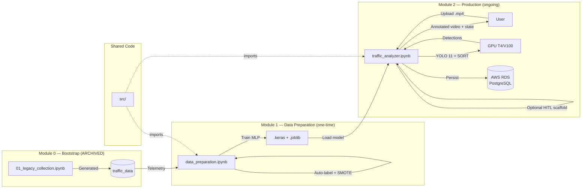

<!-- context: VAAET/README.md — Project overview.
For agentic context see AGENTS.md. For technical design see docs/DDS.md. -->

# VAAET — Video Advanced Analysis of Traffic

[](LICENSE)

Advanced vehicular traffic analysis system for the **General Manuel Belgrano Bridge** (Corrientes, Argentina), optimized for SISE dynamic surveillance cameras and long-duration video. Three-module pipeline: **bootstrap** (archived), **data preparation** (one-time training), and **production** (YOLO 11 + physics-first speed telemetry + MLP traffic classifier + optional HITL scaffold).

## Architecture



- **Module 0 — Bootstrap (archived)**: `archive/00_bootstrap/01_legacy_collection.ipynb` — Historical YOLO 11 pipeline that generated `traffic_data`. **Never runs again.**
- **Module 1 — Data Preparation**: `notebooks/01_data_prep/data_preparation.ipynb` — Feature engineering + auto-labeling + SMOTE + MLP training → exports `.keras` and `.joblib` artifacts
- **Module 2 — Production**: `notebooks/02_production/traffic_analyzer.ipynb` — YOLO 11 + SORT + physics-first speed estimation + trained MLP classifier + optional DB persistence + experimental HITL scaffold
- **Shared code**: `src/` — Reusable Python modules imported by Modules 1 and 2
- **Persistence**: PostgreSQL on AWS RDS (optional). 3 tables: `traffic_data` (legacy), `telemetry_raw` + `traffic_classifications` (active)

## Project Structure

```
vaaet/
├── archive/
│   └── 00_bootstrap/
│       ├── 01_legacy_collection.ipynb   # Module 0: Historical YOLO pipeline (FROZEN)
│       └── README.md                    # Explains deprecated status
├── notebooks/
│   ├── 01_data_prep/
│   │   └── data_preparation.ipynb       # Module 1: Feature eng. + model training
│   └── 02_production/
│       └── traffic_analyzer.ipynb       # Module 2: YOLO + classifier + feedback
├── src/
│   ├── __init__.py
│   ├── calibration.py                   # Manual bridge-landmark speed calibration helpers
│   ├── classification.py                # Shared inference + conservative accident gate
│   ├── config.py                        # Single source of truth: constants, paths, thresholds
│   ├── db.py                            # SQLAlchemy engine factory, credential handling
│   ├── features.py                      # Feature engineering + quality-aware signals
│   ├── labeling.py                      # Auto-labeling rules (4 traffic states)
│   ├── persistence.py                   # Optional DB persistence for Modules 1 and 2
│   └── perception/
│       ├── __init__.py
│       ├── detector.py                  # YOLODetector wrapper
│       ├── pipeline.py                  # Shared per-minute telemetry extraction
│       ├── tracker.py                   # SORTTracker wrapper
│       └── speed.py                     # Physics-based speed estimation
├── models/
│   ├── perception/                      # YOLO weights (downloaded at runtime, gitignored)
│   └── intelligence/                    # Module 1 artifacts (.keras, .joblib, gitignored)
├── data/
│   ├── raw/                             # DB backups (gitignored)
│   ├── processed/                       # Feature CSVs (gitignored)
│   └── samples/                         # Example data
├── docs/
│   ├── PRD.md                           # Product requirements
│   ├── DDS.md                           # Software design
│   ├── USER_GUIDE.md                    # User guide
│   ├── DATA_LINEAGE.md                  # Data lineage
│   ├── BIAS_AND_LIMITATIONS.md          # Biases and limitations
│   ├── KPIs/KPIs.md                     # Metrics and validation
│   ├── adr/                             # Architecture Decision Records (9 ADRs)
│   └── diagrams/                        # Mermaid diagrams
├── README.md, AGENTS.md, CONTRIBUTING.md, CHANGELOG.md
├── requirements.txt, llms.txt, llms-full.txt
└── LICENSE
```

## Manual Utilities

- `scripts/convert_backup.py` — one-time local helper for converting a PostgreSQL `.backup` into the CSV fallback used by Module 1 on Colab
- `scripts/evaluate_real_clips.py` — offline evaluator for comparing baseline vs candidate telemetry exports on real clips

## Quick Start

### Prerequisites

- Python 3.8+ (or Google Colab with free GPU)
- PostgreSQL on AWS RDS (optional — system degrades gracefully without DB)

```bash
pip install -r requirements.txt
```

### Module 1 — Data Preparation (run once)

1. Open `notebooks/01_data_prep/data_preparation.ipynb` in Google Colab
2. Run the required code cells in order. Optional academic cells are `7b` (cross-validation), `7c` (Drive export), and `8` (DB persistence)
3. Configure DB credentials via environment variables in Cell 2 only if you want database access (`DB_HOST`, `DB_PORT`, `DB_NAME`, `DB_USER`, `DB_PASSWORD`)
4. The system extracts telemetry from `traffic_data`, engineers 19 quality-aware features, auto-labels 4 traffic states, balances classes with SMOTE, and trains an MLP classifier
5. **Artifacts exported**: `models/intelligence/traffic_classifier.keras`, `feature_scaler.joblib`, `label_mapping.joblib`
6. **Target metric**: F1-macro ≥ 0.85

### Module 2 — Production (ongoing)

1. Open `notebooks/02_production/traffic_analyzer.ipynb` in Google Colab
2. Run Cell 0 (environment setup) and Cell 1 (load trained model)
3. Upload a video clip with format `bridge_YYYY-MM-DD_HH-MM-SS_to_HH-MM-SS.mp4`
4. Run Cell 2 for telemetry-only processing, or Cell 2b if you also want annotated video output
5. Run Cell 3 to classify traffic state using the trained MLP plus the conservative accident gate
6. Run Cell 4 to persist results to DB (optional)
7. Treat Cell 5 as an experimental HITL/retraining scaffold, not as part of the validated base workflow
8. Run Cell 6 for visualization dashboard

Automated tests verify notebook parity and code-cell compilation, but an end-to-end Google Colab smoke run is still a manual validation step.

## Key Features

| Feature | Description |
|---|---|
| **Adaptive YOLO selection** | 5 model variants selected by video duration (<1h: yolo11x, 1-3h: yolo11l, etc.) |
| **Physics-first speed estimation** | Optical-flow compensation, perspective correction, plausibility filters, and robust minute aggregation tuned for an academic Colab workflow |
| **4 traffic states** | Normal, Reduced, Congested, Accident — classified from quality-aware telemetry features with a conservative accident gate |
| **Optional HITL scaffold** | Research-oriented retraining cell kept in the notebook, but not treated as a validated production loop |
| **Multi-camera support** | Auto-detects 1, 2, or 4 camera layouts |
| **Silent degradation** | Continues without DB if unavailable; falls back to physics-only speed |
| **Strict validation** | Video filename format enforced; speeds outside range silently discarded |

## PostgreSQL Schema

### Legacy — Raw Telemetry (Module 0)

```sql
CREATE TABLE IF NOT EXISTS traffic_data (
  id SERIAL PRIMARY KEY,
  clip_id TEXT NOT NULL,
  record_time TIMESTAMP NOT NULL,
  avg_speed NUMERIC(5,2) NOT NULL,
  count_car INTEGER NOT NULL,
  count_truck INTEGER NOT NULL,
  count_bus INTEGER NOT NULL,
  count_motorcycle INTEGER NOT NULL,
  count_bicycle INTEGER NOT NULL,
  total_vehicles INTEGER NOT NULL,
  UNIQUE (clip_id, record_time)
);
```

### Active — Features + Classification (Modules 1 & 2)

```sql
CREATE TABLE IF NOT EXISTS telemetry_raw (
  id SERIAL PRIMARY KEY,
  source_record_id INTEGER UNIQUE,
  clip_id TEXT,
  record_time TIMESTAMP NOT NULL,
  avg_speed NUMERIC(8,2),
  total_vehicles INTEGER,
  count_car INTEGER, count_truck INTEGER, count_bus INTEGER,
  count_motorcycle INTEGER, count_bicycle INTEGER,
  heavy_vehicle_ratio NUMERIC(8,4),
  delta_speed NUMERIC(8,2), delta_count INTEGER,
  transition_flag SMALLINT DEFAULT 0,
  speed_variance NUMERIC(8,4),
  cumulative_delta_speed NUMERIC(8,2),
  low_speed_persistence NUMERIC(8,2),
  speed_measurement_quality NUMERIC(8,4),
  near_zero_motion_ratio NUMERIC(8,4),
  stationary_confirmed_ratio NUMERIC(8,4),
  near_zero_motion_count INTEGER,
  stationary_confirmed_count INTEGER,
  rejected_speed_count INTEGER,
  recovered_track_count INTEGER,
  speed_sample_count INTEGER,
  data_origin TEXT,
  synthetic_scenario TEXT
);

CREATE TABLE IF NOT EXISTS traffic_classifications (
  id SERIAL PRIMARY KEY,
  telemetry_id INTEGER REFERENCES telemetry_raw(id),
  classified_at TIMESTAMP DEFAULT CURRENT_TIMESTAMP,
  traffic_state SMALLINT NOT NULL,
  state_label TEXT NOT NULL,
  confidence NUMERIC(8,4) NOT NULL,
  model_version TEXT NOT NULL,
  model_traffic_state SMALLINT,
  model_state_label TEXT,
  model_confidence NUMERIC(8,4),
  accident_rule_triggered BOOLEAN DEFAULT FALSE,
  accident_gate_applied BOOLEAN DEFAULT FALSE,
  accident_evidence_score NUMERIC(8,4),
  is_human_validated BOOLEAN DEFAULT FALSE,
  human_override_state SMALLINT,
  validated_at TIMESTAMP,
  UNIQUE (telemetry_id, model_version)
);
```

## Security

- Credentials are **never** exposed in cell outputs
- DB persistence only activates when all environment variables are present
- No hardcoded connection strings

## Bridge & Camera Context

- **Bridge**: General Manuel Belgrano, 1700m length, 8.3m roadway width
- **Cameras**: SISE dynamic at 60m height, with zoom, pan, night vision
- **Vehicle types**: car, truck, bus, motorcycle, bicycle
- **Typical speeds**: 40-80 km/h normal flow, 0-20 km/h congestion

## Dependencies

**Core**: numpy, pandas, sqlalchemy, psycopg2-binary, joblib

**Data Preparation (Module 1)**: tensorflow, scikit-learn, imbalanced-learn, matplotlib, seaborn

**Production (Module 2)**: ultralytics, opencv-python, tensorflow, scikit-learn

```bash
pip install -r requirements.txt
```

## Academic Validation

- Speed calibration remains lightweight and academic: bridge landmarks, manual timing, and pseudo-ground-truth helpers in `src/calibration.py`
- `near_zero_motion` and `stationary_confirmed` are tracked separately to reduce false stationary labels in congestion
- `Accident` is treated as a rare, conservative class supported by rules plus synthetic episodes until enough real cases exist
- The runtime target is Google Colab free, so infrastructure-heavy optimizations are intentionally out of scope

## Documentation

| Document | Description |
|---|---|
| [docs/PRD.md](docs/PRD.md) | Product requirements |
| [docs/DDS.md](docs/DDS.md) | Software design and diagrams |
| [docs/USER_GUIDE.md](docs/USER_GUIDE.md) | User guide |
| [docs/KPIs/KPIs.md](docs/KPIs/KPIs.md) | Metrics and validation |
| [docs/DATA_LINEAGE.md](docs/DATA_LINEAGE.md) | Data lineage |
| [docs/BIAS_AND_LIMITATIONS.md](docs/BIAS_AND_LIMITATIONS.md) | Biases and limitations |
| [docs/adr/](docs/adr/) | Architecture Decision Records (9 ADRs) |
| [docs/diagrams/](docs/diagrams/) | Mermaid diagrams |
| [AGENTS.md](AGENTS.md) | Agentic context for AI agents |
| [CONTRIBUTING.md](CONTRIBUTING.md) | Contribution guide |

## Synthetic Demos

Module 0 includes a synthetic video generator (archived) for portfolio demos without requiring real bridge footage. Scenarios: light, normal, busy, mixed, stationary_test.

## Support

For calibration, advanced integration, or questions, consult the notebooks, the [user guide](docs/USER_GUIDE.md), and the inline comments in each cell.
