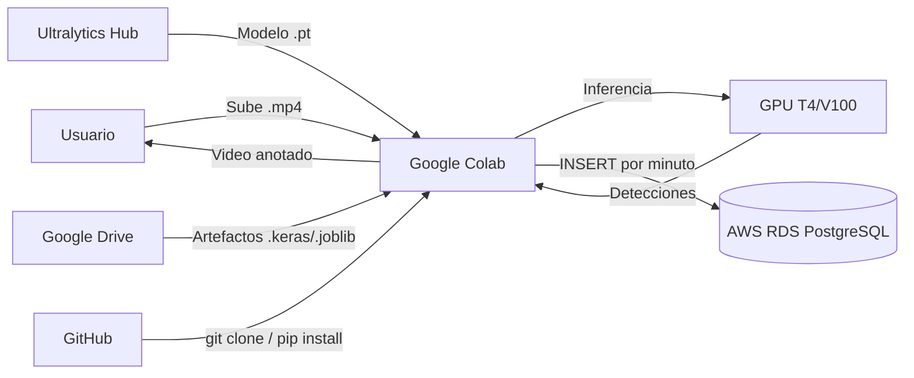

<!-- context: VAAET/docs/DEPLOYMENT.md — Manual de despliegue.
Complementa USER_GUIDE.md y SAD.md. -->

# Manual de Despliegue (DevOps Playbook) — VAAET

## Identificación del Proyecto

| Campo | Detalles |
|---|---|
| **Nombre del Proyecto** | VAAET — Video Advanced Analysis of Traffic |
| **Versión** | 3.0.0 |
| **Estado** | Aprobado |
| **Responsable Técnico** | Facundo Nicolás González |
| **Última Revisión** | 2026-07-23 |

---

## 1. Arquitectura de Infraestructura

VAAET opera en un modelo "Notebook-as-Runtime": Google Colab es el entorno de ejecución, AWS RDS provee persistencia opcional, y los artefactos de modelo se comparten vía Google Drive.

### 1.1 Componentes del Sistema

| Componente | Tecnología | Responsabilidad |
|---|---|---|
| **Runtime** | Google Colab Free/Pro | Ejecución de notebooks con GPU T4/V100 |
| **Código fuente** | GitHub | Versionado y CI/CD |
| **Base de datos** | PostgreSQL 12+ en AWS RDS | Persistencia de telemetría (opcional) |
| **Almacenamiento de modelos** | Google Drive / local | Artefactos `.keras` y `.joblib` |
| **Almacenamiento de video** | Local / Colab temporal | Videos de entrada y salida |

### 1.2 Diagrama de Infraestructura



---

## 2. Entornos de Ciclo de Vida

| Entorno | Plataforma | Propósito | Datos |
|---|---|---|---|
| **Desarrollo local** | Python 3.8+ local | Desarrollo y testing de `src/` | Datos sintéticos, sin GPU |
| **Google Colab** | Colab Free/Pro | Ejecución de notebooks (entorno principal) | Videos reales, GPU disponible |
| **CI** | GitHub Actions | Validación automática | Tests unitarios, sin GPU ni BD |

---

## 3. Pipeline de CI/CD

### 3.1 Integración Continua (CI)

Se activa mediante **push** o **pull request** a `main`.

Pipeline definido en `.github/workflows/ci.yml`:

1. **Instalación**: `pip install -e ".[all]"`
2. **Tests**: `pytest tests/ -v --tb=short -x`
3. **Compilación de notebooks**: Verificación sintáctica con `ast.parse()`
4. **Verificación de enlaces**: Detección de enlaces rotos en documentación

### 3.2 Despliegue (Manual)

VAAET no tiene despliegue automatizado porque el runtime es Google Colab. El "despliegue" consiste en:

1. El usuario abre el notebook en Colab desde GitHub
2. La Celda 0 instala dependencias y clona el repo
3. La Celda 1 carga artefactos del modelo

---

## 4. Procedimiento de Setup en Google Colab

### Celda 0 — Setup del Entorno

```python
# Clonar repositorio
!git clone https://github.com/zgfnicolas/vaaet.git
%cd vaaet

# Instalar como paquete
!pip install -e ".[perception,intelligence]"
```

### Celda 1 — Configuración de BD (Opcional)

```python
import os
os.environ['DB_HOST'] = 'tu-instancia.rds.amazonaws.com'
os.environ['DB_PORT'] = '5432'
os.environ['DB_NAME'] = 'vaaet'
# Credenciales vía getpass (nunca hardcodear)
import getpass
os.environ['DB_USER'] = getpass.getpass('DB User: ')
os.environ['DB_PASSWORD'] = getpass.getpass('DB Password: ')
```

---

## 5. Gestión de Secretos

| Secreto | Mecanismo | Ubicación |
|---|---|---|
| Credenciales de BD | Variables de entorno + `getpass` | Runtime de Colab |
| Token de GitHub | Configuración de Colab | Secrets de Colab |

**Está estrictamente prohibido:**
- Hardcodear credenciales en código
- Imprimir credenciales en outputs de celdas
- Commitear archivos `.env` al repositorio

---

## 6. Estrategia de Base de Datos

### Creación de Tablas

Las tablas se crean automáticamente con `CREATE TABLE IF NOT EXISTS` al ejecutar la celda de persistencia. No hay sistema formal de migraciones.

### Backups

- Backup manual vía `pg_dump` almacenado en `data/raw/` (gitignored)
- Script de conversión: `scripts/convert_backup.py`
- **Recomendación:** Configurar backups automáticos en AWS RDS (diarios, retención 7 días)

---

## 7. Monitoreo y Resolución de Problemas

### Indicadores de Salud

| Indicador | Rango Normal | Acción si Anormal |
|---|---|---|
| `speed_measurement_quality` | > 0.70 | Revisar calidad del video, verificar flujo óptico |
| `rejected_speed_count` por minuto | < 30% del total | Verificar calibración de `pixels_per_meter` |
| F1-macro del clasificador | ≥ 0.85 | Re-entrenar con datos nuevos |

### Procedimiento de Rollback

En caso de error en los artefactos del modelo:
1. Restaurar artefactos previos desde Google Drive
2. Verificar F1-macro con el dataset de test
3. Si no hay backup, re-ejecutar Módulo 1 completo

---

## 8. Checklist de Despliegue

- [ ] Tests pasan en CI (`pytest tests/ -v`)
- [ ] Notebooks compilan sin errores de sintaxis
- [ ] Artefactos del modelo están exportados a Google Drive
- [ ] Variables de entorno de BD documentadas en `.env.example`
- [ ] CHANGELOG actualizado con cambios de la versión
- [ ] Documentación actualizada si hay cambios en features o flujo

---

Responsable del documento: Facundo Nicolás González
Fecha de revisión: 2026-07-23
