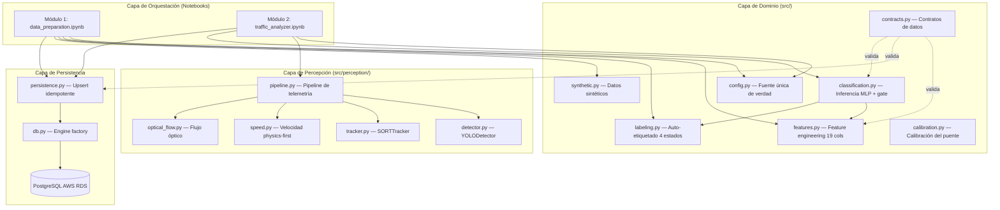
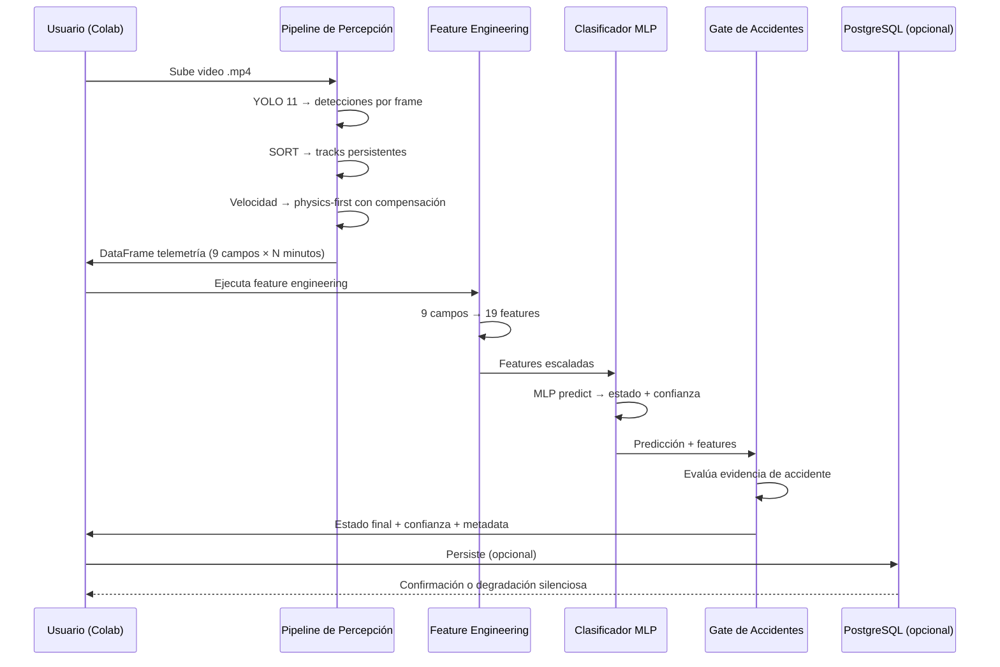
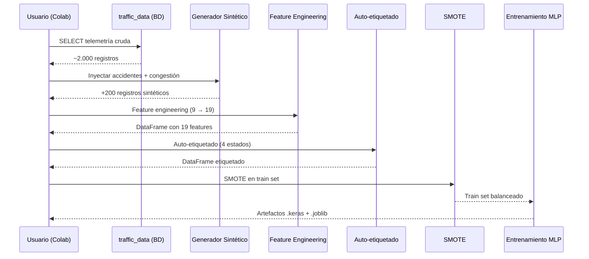

<!-- context: VAAET/docs/SAD.md — Documento de Arquitectura de Software.
Reemplaza al antiguo DDS.md. Complementa SRS.md y DATA_MODEL.md. -->

# Documento de Arquitectura de Software (SAD) — VAAET

## Identificación del Proyecto

| Campo | Detalles |
|---|---|
| **Nombre del Proyecto** | VAAET — Video Advanced Analysis of Traffic |
| **Versión** | 3.0.0 |
| **Fecha de Creación** | 2025-03-06 |
| **Estado** | Aprobado |
| **Responsable Técnico** | Facundo Nicolás González |
| **Última Revisión** | 2026-07-23 |

---

## 1. Introducción y Alcance

### 1.1 Propósito

Este documento define la arquitectura técnica del sistema VAAET, documentando las decisiones de diseño, los patrones utilizados, y la topología de los componentes. Está dirigido a desarrolladores, arquitectos, y agentes de IA que necesiten comprender la estructura interna del sistema.

### 1.2 Alcance del Sistema

VAAET es un pipeline CT/CI (Continuous Training / Continuous Inference) de MLOps Nivel 1 que procesa video de vigilancia para detectar vehículos, estimar velocidades, y clasificar el estado del tráfico. Opera como notebooks de Google Colab que orquestan módulos Python compartidos.

---

## 2. Arquitectura y Diseño de Sistemas

### 2.1 Paradigmas y Patrones

- **Arquitectura global**: Pipeline CT/CI MLOps con tres módulos secuenciales
- **Principios de codificación**: SOLID, KISS, YAGNI, DRY
- **Patrón de capas**:
  - **Capa de orquestación**: Notebooks (`.ipynb`) — interfaz Colab, flujo de ejecución
  - **Capa de dominio**: `src/` — lógica de negocio, feature engineering, clasificación
  - **Capa de percepción**: `src/perception/` — detección, tracking, estimación de velocidad
  - **Capa de persistencia**: `src/persistence.py` + `src/db.py` — PostgreSQL opcional

### 2.2 Diagrama de Arquitectura



### 2.3 Reglas de Dependencia

```
src/config.py          ← Todos los módulos dependen (single source of truth)
src/perception/*       ← Solo Módulo 2
src/features.py        ← Módulos 1 y 2
src/labeling.py        ← Módulos 1 y 2
src/classification.py  ← Módulo 2
src/persistence.py     ← Módulos 1 y 2 (opcional)
src/contracts.py       ← Validación transversal
src/synthetic.py       ← Solo Módulo 1
```

---

## 3. Datos y Persistencia

### 3.1 Estrategia de Persistencia

| Componente | Tipo / Motor | Justificación Técnica |
|---|---|---|
| Almacenamiento principal | PostgreSQL 12+ (AWS RDS) | Consistencia ACID para telemetría temporal con integridad referencial |
| Almacenamiento de modelos | Google Drive / local | Artefactos `.keras` y `.joblib` exportados por Módulo 1 |
| Almacenamiento de video | Ephemeral (Colab) | Videos no se persisten — solo datos agregados por minuto |

### 3.2 Esquema de Base de Datos

Ver [DATA_MODEL.md](DATA_MODEL.md) para el diccionario completo de 3 tablas.

**Resiliencia**: El sistema usa `CREATE TABLE IF NOT EXISTS` como mecanismo de migración. No hay ORM — consultas SQL directas con parámetros vía SQLAlchemy `text()`.

---

## 4. Flujos de Datos

### 4.1 Flujo de Producción (Módulo 2)



### 4.2 Flujo de Entrenamiento (Módulo 1)



---

## 5. Seguridad y Operaciones

### 5.1 Autenticación y Credenciales

- Credenciales de BD por variables de entorno exclusivamente
- En Colab, se usa `getpass` para entrada segura
- No hay autenticación de usuarios (runtime de notebook individual)

### 5.2 Resiliencia

- **Degradación silenciosa**: Si la BD no está disponible, el pipeline continúa sin persistencia
- **Frame skip**: Frames corruptos se saltan sin detener el procesamiento
- **Fallback de velocidad**: Sin flujo óptico, se usa velocidad sin compensación de cámara

### 5.3 CI/CD

- **GitHub Actions**: Tests automáticos en Python 3.10/3.11/3.12
- **Compilación de notebooks**: Verificación sintáctica con `ast.parse()`
- **Verificación de enlaces**: Detección de enlaces rotos en documentación

---

## 6. Registro de Decisiones Arquitectónicas (ADR)

| ID | Decisión | Contexto / Justificación | Estado |
|---|---|---|---|
| ADR-001 | Notebook monolítico | Diseño inicial para una sola fase | Supersedido por ADR-009 |
| ADR-002 | Selección adaptativa de YOLO 11 | 5 variantes por duración de video | Aceptado |
| ADR-003 | SORT sobre DeepSORT | Menor consumo de recursos en Colab | Aceptado |
| ADR-004 | MLP como suavizador de velocidad | Regularización hacia la media | Aceptado (histórico) |
| ADR-005 | PostgreSQL en AWS RDS | Persistencia relacional ACID | Aceptado |
| ADR-006 | Detección conservadora de estacionarios | AND de 6 criterios con histéresis | Aceptado |
| ADR-007 | Google Colab como runtime | Costo cero, GPU gratuita | Aceptado |
| ADR-008 | TensorFlow/Keras para clasificador | Ecosistema maduro para Colab | Aceptado |
| ADR-009 | Arquitectura modular de tres módulos | Desacoplamiento, testabilidad, SOLID | Aceptado |
| ADR-010 | Pipeline MLOps con 19 features | Señales de calidad, contratos, proveniencia | Aceptado |

Ver carpeta completa: [docs/adr/](adr/)

---

## 7. Apéndices y Referencias

| Referencia | Título | Enlace |
|---|---|---|
| REF-01 | Especificación de Requisitos (SRS) | [SRS.md](SRS.md) |
| REF-02 | Modelo de Datos | [DATA_MODEL.md](DATA_MODEL.md) |
| REF-03 | Linaje de Datos | [DATA_LINEAGE.md](DATA_LINEAGE.md) |
| REF-04 | Plan de Pruebas | [TEST_PLAN.md](TEST_PLAN.md) |
| REF-05 | Model Card | [MODEL_CARD.md](MODEL_CARD.md) |
| REF-06 | Sesgos y Limitaciones | [BIAS_AND_LIMITATIONS.md](BIAS_AND_LIMITATIONS.md) |

---

Responsable del documento: Facundo Nicolás González
Fecha de revisión: 2026-07-23
