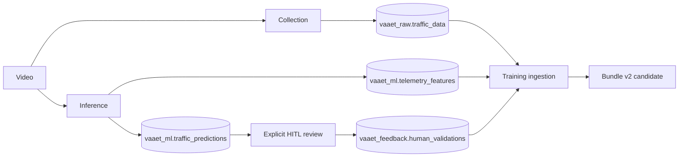

# Linaje de datos — VAAET ML 4.2.0

## Flujo operacional

Cada ejecución de adquisición o inferencia genera un `pipeline_run_id`. Los
timestamps se persisten como `TIMESTAMPTZ` UTC; valores históricos sin zona se
interpretan como `America/Argentina/Buenos_Aires` durante la migración.

Desde 4.2.0 el UUID referencia `vaaet_ops.pipeline_runs`, que registra workflow,
estado, commit, contratos y conteos sin secretos. Cuando PostgreSQL es opcional,
el mismo contrato se conserva como JSON bajo `data/processed/pipeline-runs/`.

## Adquisición

`collect_traffic_telemetry.ipynb` produce video anotado, CSV raw y, al habilitarlo,
inserta exclusivamente en `vaaet_raw.traffic_data`. La unicidad
`(clip_id, record_time)` hace idempotente la repetición. No se persisten frames,
patentes ni identidades.

## Inferencia y revisión

`analyze_traffic_video.ipynb` persiste las 19 features y predicciones estables
0–2 con el perfil `inference`. Después del clip, una celda opcional abre una cola
`priority` o `all`; no interrumpe el procesamiento con pop-ups. El perfil
`review` agrega validaciones sin modificar predicciones. El modo `all` conserva la
validación previa como `supersedes_validation_id` al corregir. Accident requiere nota y
revisión explícita del contexto. Sin base disponible se exporta
`vaaet-training-dataset-v1.zip`.

## Entrenamiento

`TrainingIngestionPlan` declara fuentes raw y feedback. Puede combinar servidor,
backup, CSV raw y paquete contractual. El tipo nunca se infiere por columnas:

- raw: auditoría, ingeniería de las 19 features y etiqueta proxy;
- feedback: contrato de feature schema y última validación humana, sin recalcular;
- estados humanos 0–2: candidatos al MLP;
- estado humano 3: evaluación del detector de incidente, nunca target del MLP.

La etiqueta humana prevalece sobre el proxy para el mismo minuto. Conflictos
entre validaciones efectivas detienen el entrenamiento. Sintéticos sólo aparecen
en train y siempre permanecen identificados.
