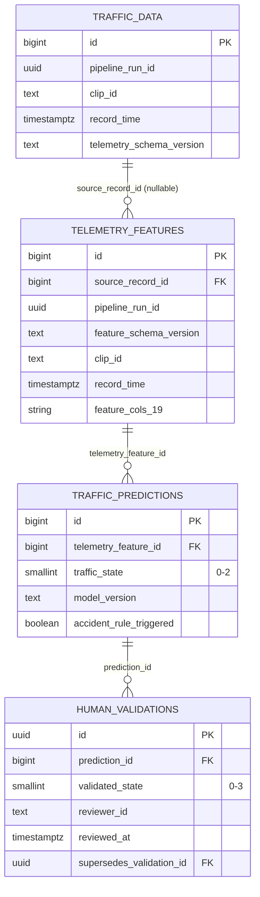

# Modelo PostgreSQL — `vaaet-db-v2`

VAAET ML 4.1.0 usa PostgreSQL 14+ y Alembic como única autoridad DDL. Los
notebooks nunca crean ni alteran tablas. La migración vigente es
[`20260804_0001_postgres_schemas_hitl.py`](../../migrations/versions/20260804_0001_postgres_schemas_hitl.py).

## Relaciones



## Contratos

| Objeto | Responsabilidad | Clave idempotente |
|---|---|---|
| `vaaet_raw.traffic_data` | Telemetría v2 y métricas de calidad | `(clip_id, record_time)` |
| `vaaet_ml.telemetry_features` | Orden exacto de las 19 features y procedencia | `(clip_id, record_time, feature_schema_version)` |
| `vaaet_ml.traffic_predictions` | MLP, política temporal y candidato de incidente | `(telemetry_feature_id, model_version)` |
| `vaaet_feedback.human_validations` | Revisión humana append-only | UUID; sustitución explícita por FK |

Todas las fechas son `TIMESTAMPTZ` UTC. Ratios están restringidos a `[0,1]`,
conteos a valores no negativos y estados automáticos a `0–2`. El estado público
3 sólo puede existir en una validación humana que incluya nota y confirme que se
revisó el contexto temporal.

## Vistas

- `vaaet_feedback.review_queue`: predicciones con su validación más reciente; el modo
  `priority` excluye revisadas y `all` permite correcciones append-only.
- `vaaet_feedback.effective_human_labels`: última validación por predicción.
- `public.traffic_data`, `public.telemetry_raw` y
  `public.traffic_classifications`: compatibilidad read-only durante 4.x.

Las vistas `public` no son el contrato para código nuevo y se eliminarán en
5.0.0.

## Roles

| Rol de grupo | Permisos |
|---|---|
| `vaaet_collection_role` | SELECT/INSERT raw |
| `vaaet_inference_role` | SELECT/INSERT/UPDATE features y predicciones |
| `vaaet_training_role` | SELECT en los tres schemas |
| `vaaet_reviewer_role` | SELECT de cola/predicciones e INSERT de validaciones |

El administrador aplica `alembic upgrade head` y
[`provision-roles.sql`](../../migrations/provision-roles.sql), luego crea usuarios
LOGIN específicos del proveedor y les concede un solo rol de grupo.

## Backups

Backup canónico:

```bash
pg_dump --format=custom --no-owner --no-acl \
  --schema=vaaet_raw --schema=vaaet_ml --schema=vaaet_feedback \
  --file=vaaet-db-v2.backup "$DATABASE_URL"
```

El importador inspecciona primero `pg_restore -l`, restaura únicamente tablas
VAAET explícitas a SQL temporal y nunca aplica roles ni DDL del backup contra una
base viva. Backups legacy con `public.traffic_data` siguen disponibles como raw.
