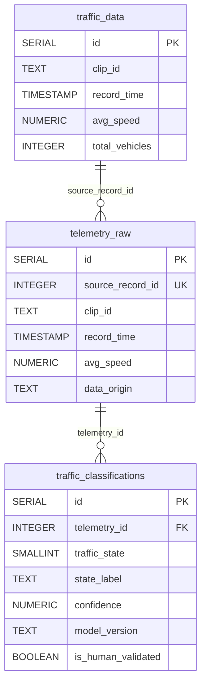

<!-- context: VAAET/docs/architecture/data-model.md — Modelo de datos y diccionario.
Complementa SAD.md (arquitectura) y DATA_LINEAGE.md (linaje). -->

# Modelo de Datos y Diccionario — VAAET

## Identificación del Proyecto

| Campo | Detalles |
|---|---|
| **Nombre del Proyecto** | VAAET — Video Advanced Analysis of Traffic |
| **Versión** | 4.0.0 |
| **Fecha de Creación** | 2025-03-06 |
| **Estado** | Aprobado |
| **Responsable Técnico** | Facundo Nicolás González |
| **Última Revisión** | 2026-07-23 |
| **Motor de BD** | PostgreSQL 12+ (AWS RDS) |
| **Nivel de Normalización** | 3NF |

---

## 1. Diccionario de Datos

### Tabla: `traffic_data` (adquisición cruda)

**Descripción:** Almacena telemetría cruda generada por el workflow opcional de adquisición. Es una fuente de datos del entrenamiento y acepta nuevos registros idempotentes.

| Campo | Tipo de Dato | Restricciones | Descripción | Ejemplo |
|---|---|---|---|---|
| `id` | SERIAL | PK, NOT NULL | Identificador autoincremental | 1 |
| `clip_id` | TEXT | NOT NULL | Identificador derivado del nombre del archivo de video | bridge_2025-04-28_08-00-00_to_09-00-00 |
| `record_time` | TIMESTAMP | NOT NULL | Marca temporal del minuto registrado | 2025-04-28 08:01:00 |
| `avg_speed` | NUMERIC(5,2) | NOT NULL | Velocidad promedio de vehículos en movimiento (km/h) | 45.30 |
| `count_car` | INTEGER | NOT NULL | Autos detectados en el minuto | 12 |
| `count_truck` | INTEGER | NOT NULL | Camiones detectados | 3 |
| `count_bus` | INTEGER | NOT NULL | Colectivos detectados | 1 |
| `count_motorcycle` | INTEGER | NOT NULL | Motocicletas detectadas | 2 |
| `count_bicycle` | INTEGER | NOT NULL | Bicicletas detectadas | 0 |
| `total_vehicles` | INTEGER | NOT NULL | Total de vehículos en el minuto | 18 |
| `near_zero_motion_count` | INTEGER | NULL en v1 | Tracks únicos con movimiento casi nulo | 2 |
| `stationary_confirmed_count` | INTEGER | NULL en v1 | Tracks únicos confirmados estacionarios | 1 |
| `rejected_speed_count` | INTEGER | NULL en v1 | Tracks únicos cuya medición fue rechazada | 1 |
| `recovered_track_count` | INTEGER | NULL en v1 | Tracks únicos recuperados tras un gap | 0 |
| `speed_sample_count` | INTEGER | NULL en v1 | Tracks únicos con velocidad aceptada | 8 |
| `speed_measurement_quality` | NUMERIC(8,4) | NULL en v1 | Aceptados / intentos válidos | 0.8889 |
| `optical_flow_tracking_ratio` | NUMERIC(8,4) | NULL en v1 | Calidad media del flujo óptico | 0.9200 |
| `telemetry_schema_version` | TEXT | NULL en v1 | `traffic-telemetry-v2` para registros modernos | traffic-telemetry-v2 |

**Restricción UNIQUE:** `(clip_id, record_time)` — Un registro por minuto por clip.

---

### Tabla: `telemetry_raw` (entrenamiento, inferencia y feedback)

**Descripción:** Almacena telemetría enriquecida con 19 features de calidad, señales de proveniencia (real/sintético), y contadores de calidad de medición. Fuente de verdad para el clasificador.

| Campo | Tipo de Dato | Restricciones | Descripción | Ejemplo |
|---|---|---|---|---|
| `id` | SERIAL | PK, NOT NULL | Identificador autoincremental | 1 |
| `source_record_id` | INTEGER | UNIQUE | FK lógico hacia `traffic_data.id` (NULL para datos nuevos) | 42 |
| `clip_id` | TEXT | — | Identificador del clip de video | bridge_2025-04-28_08-00-00_to_09-00-00 |
| `record_time` | TIMESTAMP | NOT NULL | Marca temporal del minuto | 2025-04-28 08:01:00 |
| `avg_speed` | NUMERIC(8,2) | — | Velocidad promedio (km/h) | 45.30 |
| `total_vehicles` | INTEGER | — | Total de vehículos detectados | 18 |
| `count_car` | INTEGER | — | Autos | 12 |
| `count_truck` | INTEGER | — | Camiones | 3 |
| `count_bus` | INTEGER | — | Colectivos | 1 |
| `count_motorcycle` | INTEGER | — | Motocicletas | 2 |
| `count_bicycle` | INTEGER | — | Bicicletas | 0 |
| `heavy_vehicle_ratio` | NUMERIC(8,4) | — | Ratio de vehículos pesados: `(truck+bus)/total` | 0.2222 |
| `delta_speed` | NUMERIC(8,2) | — | Cambio de velocidad vs minuto anterior | -5.20 |
| `delta_count` | INTEGER | — | Cambio de conteo vs minuto anterior | 3 |
| `transition_flag` | SMALLINT | DEFAULT 0 | Flag de cambio abrupto simultáneo (0/1) | 0 |
| `speed_variance` | NUMERIC(8,4) | — | Varianza de velocidad en ventana rolling(5) | 12.3456 |
| `cumulative_delta_speed` | NUMERIC(8,2) | — | Delta de velocidad acumulado en ventana rolling | -8.50 |
| `low_speed_persistence` | NUMERIC(8,2) | — | Persistencia de baja velocidad en ventana rolling | 0.60 |
| `speed_measurement_quality` | NUMERIC(8,4) | — | Ratio de muestras aceptadas/intentadas | 0.8500 |
| `optical_flow_tracking_ratio` | NUMERIC(8,4) | — | Calidad media del tracking por flujo óptico | 0.9200 |
| `near_zero_motion_ratio` | NUMERIC(8,4) | — | Ratio de tracks con movimiento cercano a cero | 0.1500 |
| `stationary_confirmed_ratio` | NUMERIC(8,4) | — | Ratio de tracks confirmados como estacionarios | 0.0500 |
| `near_zero_motion_count` | INTEGER | — | Contador absoluto de near-zero-motion | 3 |
| `stationary_confirmed_count` | INTEGER | — | Contador absoluto de estacionarios confirmados | 1 |
| `rejected_speed_count` | INTEGER | — | Muestras de velocidad rechazadas por filtros | 2 |
| `recovered_track_count` | INTEGER | — | Tracks recuperados después de un gap | 0 |
| `speed_sample_count` | INTEGER | — | Total de muestras de velocidad aceptadas | 15 |
| `telemetry_schema_version` | TEXT | — | Versión de la semántica de adquisición | traffic-telemetry-v2 |
| `data_origin` | TEXT | — | Proveniencia: `"real"` o `"synthetic"` | real |
| `synthetic_scenario` | TEXT | — | Escenario: `"observed"`, `"accident"`, `"congestion"` | observed |

---

### Tabla: `traffic_classifications` (Activa — Módulos 1 y 2)

**Descripción:** Almacena la salida del MLP de tres clases, el estado estable final, candidatos de incidente y campos HITL. `Accident` sólo es válido con confirmación humana.

| Campo | Tipo de Dato | Restricciones | Descripción | Ejemplo |
|---|---|---|---|---|
| `id` | SERIAL | PK, NOT NULL | Identificador autoincremental | 1 |
| `telemetry_id` | INTEGER | FK → telemetry_raw(id) | Referencia al registro de telemetría | 42 |
| `classified_at` | TIMESTAMP | DEFAULT NOW() | Momento de la clasificación | 2025-07-14 10:30:00 |
| `traffic_state` | SMALLINT | NOT NULL | Estado final del tráfico (0-3) | 0 |
| `state_label` | TEXT | NOT NULL | Etiqueta legible del estado | Normal |
| `confidence` | NUMERIC(8,4) | NOT NULL | Score del estado estable; no se denomina probabilidad sin calibración | 0.9200 |
| `model_version` | TEXT | NOT NULL | Versión del modelo usado | mlp-v2.0 |
| `model_traffic_state` | SMALLINT | — | Estado predicho por el modelo (pre-gate) | 0 |
| `model_state_label` | TEXT | — | Etiqueta del estado pre-gate | Normal |
| `model_confidence` | NUMERIC(8,4) | — | Confianza original del modelo | 0.9200 |
| `probability_margin` | NUMERIC(8,4) | — | Diferencia entre las dos mayores probabilidades calibradas | 0.4100 |
| `decision_abstained` | BOOLEAN | DEFAULT FALSE | Si se conservó el estado previo por ambigüedad/persistencia | false |
| `measurement_reliable` | BOOLEAN | — | Calidad suficiente para evaluar un candidato de incidente | true |
| `accident_rule_triggered` | BOOLEAN | DEFAULT FALSE | Si la evidencia de accidente superó el umbral | false |
| `accident_alert_started` | BOOLEAN | DEFAULT FALSE | Inicio deduplicado de un nuevo candidato | false |
| `accident_gate_applied` | BOOLEAN | DEFAULT FALSE | Compatibilidad histórica; debe ser siempre false en v2 | false |
| `accident_evidence_score` | NUMERIC(8,4) | — | Score de evidencia de accidente [0,1] | 0.15 |
| `is_human_validated` | BOOLEAN | DEFAULT FALSE | Si un operador SISE validó este registro | false |
| `human_override_state` | SMALLINT | — | Estado corregido por el operador | NULL |
| `validated_at` | TIMESTAMP | — | Momento de la validación humana | NULL |

**Restricción UNIQUE:** `(telemetry_id, model_version)` — Una clasificación por registro por versión de modelo.

La etiqueta efectiva para reentrenamiento es `COALESCE(human_override_state, traffic_state)`, exclusivamente cuando `is_human_validated=true`. La migración está en `migrations/0001-traffic-data-telemetry-v2.sql`; las filas históricas conservan `NULL` y schema v1.

---

## 2. Integridad Referencial y Relaciones

| Relación (Origen → Destino) | Cardinalidad | ON DELETE | ON UPDATE | Justificación |
|---|---|---|---|---|
| `telemetry_raw.source_record_id` → `traffic_data.id` | 1:1 (lógica) | N/A (no FK formal) | N/A | Trazabilidad hacia adquisición cruda. Puede ser NULL para inferencias sin origen persistido. |
| `traffic_classifications.telemetry_id` → `telemetry_raw.id` | N:1 | CASCADE implícito | CASCADE implícito | Cada clasificación referencia exactamente una fila de telemetría. Múltiples versiones de modelo pueden clasificar el mismo registro. |

---

## 3. Estrategia de Optimización e Indexación

| Tabla | Nombre del Índice | Columnas | Tipo | Propósito |
|---|---|---|---|---|
| `traffic_data` | `idx_td_clip_time` | `(clip_id, record_time)` | B-Tree / UNIQUE | Constraint de unicidad + búsqueda por clip y tiempo |
| `telemetry_raw` | `idx_tr_source_id` | `source_record_id` | B-Tree / UNIQUE | Buscar registro fuente rápidamente |
| `telemetry_raw` | `idx_tr_record_time` | `record_time` | B-Tree | Consultas temporales para dashboards |
| `traffic_classifications` | `idx_tc_tel_model` | `(telemetry_id, model_version)` | B-Tree / UNIQUE | Constraint de unicidad + join rápido |

---

## 4. Lógica Programable

### Upsert Idempotente

VAAET utiliza `ON CONFLICT ... DO UPDATE` (upsert) para garantizar idempotencia en la persistencia. Esto permite re-procesar clips sin generar duplicados.

- `telemetry_raw`: Upsert por `source_record_id`
- `traffic_classifications`: Upsert por `(telemetry_id, model_version)`

### Sin Triggers ni Stored Procedures

El proyecto no utiliza lógica programable en la BD por diseño (ver [ADR-0005](decisions/0005-postgresql-aws-rds.md)). Toda la lógica de negocio reside en `src/vaaet/` para mantener la portabilidad y testabilidad.

---

## 5. Modelo de Seguridad

| Rol | Perímetro de Acción | Permisos | Justificación |
|---|---|---|---|
| `vaaet_app` | Notebooks Colab | SELECT, INSERT, UPDATE | Operaciones transaccionales del pipeline |
| `vaaet_readonly` | Dashboards / BI | SELECT | Consultas de lectura para análisis sin riesgo de alteración |
| Administrador RDS | Infraestructura AWS | ALL | Gestión de instancia, backups, mantenimiento |

**Nota:** Los roles de BD no están implementados formalmente en la versión actual (el pipeline usa un único usuario). Se documentan como recomendación para la evolución a producción.

---

## 6. Referencias de Modelado

- **Diagrama ERD**: [docs/diagrams/erd.md](diagrams/erd.md), [docs/diagrams/erd-phase2.md](diagrams/erd-phase2.md)
- **Fuente de verdad del esquema**: [persistence.py](../../src/vaaet/data/persistence.py)
- **Convención de nomenclatura**: `snake_case` para tablas y columnas

---

Responsable del documento: Facundo Nicolás González
Fecha de revisión: 2026-07-23
