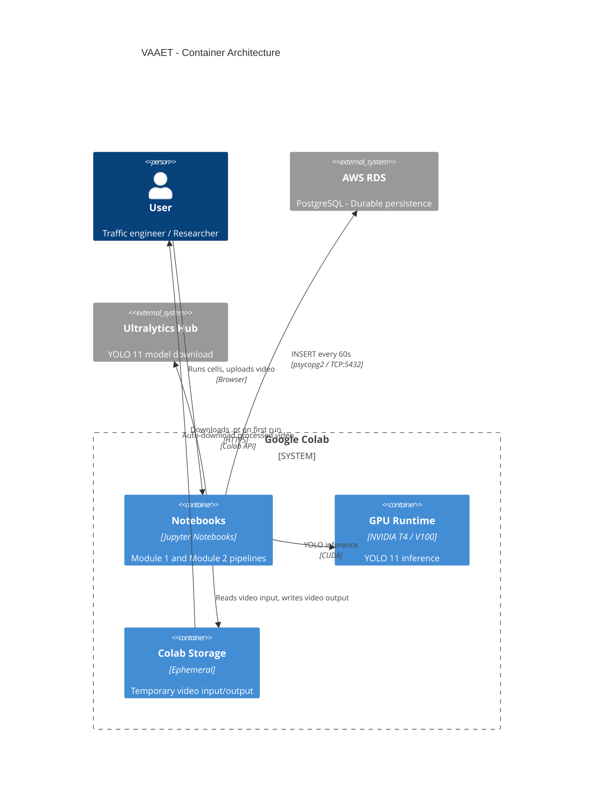
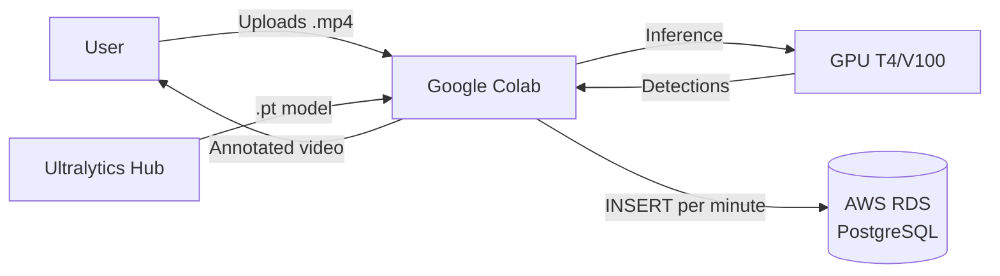

<!-- context: VAAET/docs/diagrams/colab-aws-architecture.md — C4 container diagram.
Referenced by SAD.md, AGENTS.md, ADR-005, ADR-007. -->

# Colab + AWS RDS Architecture

Container diagram showing the runtime infrastructure.

## Data Flow

## Security Notes

- RDS credentials are obtained via **environment variables** (`DB_HOST`, `DB_PORT`, `DB_NAME`, `DB_USER`, `DB_PASSWORD`) or interactive **`getpass`**
- Credentials are never printed in cell outputs
- RDS connection uses standard port 5432 without SSL (pending improvement)
- Colab storage is ephemeral — videos are lost when the session ends
