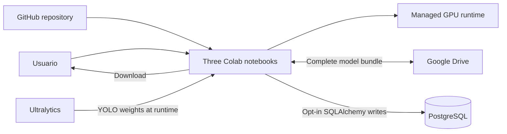

# Arquitectura Colab y PostgreSQL

Las credenciales se leen de Colab Secrets con variables de entorno como fallback. `/content` es efímero; los outputs deben descargarse o copiarse. La persistencia está deshabilitada por defecto.
