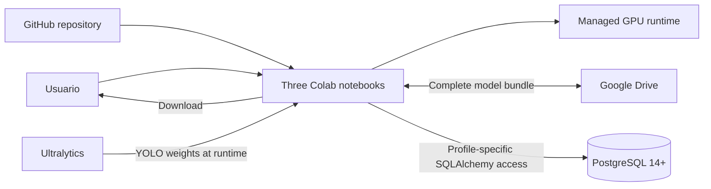

# Arquitectura Colab y PostgreSQL

Las credenciales por perfil se leen directamente de Colab Secrets. `vaaet_raw`,
`vaaet_ml` y `vaaet_feedback` separan responsabilidades; Alembic y el administrador
nunca se ejecutan desde Colab. `/content` es efímero y la persistencia permanece
deshabilitada por defecto.
