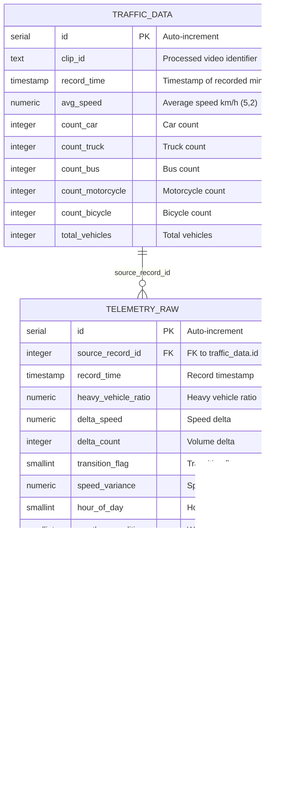

<!-- context: VAAET/docs/diagrams/erd.md — Entity-Relationship diagram.
Referenced by SAD.md, ADR-005, README.md. -->

# Database Schema (ERD)

Table `traffic_data` (Module 0 — legacy) with Module 1 extensions: `telemetry_raw` and `traffic_classifications`.

For the complete ERD with all 3 tables, see [erd-phase2.md](erd-phase2.md).



## Constraints

- **Primary Key**: `id` (auto-increment)
- **Unique**: `(clip_id, record_time)` — prevents duplicates if the same video is re-processed
- **Not Null**: `clip_id`, `record_time`, `avg_speed`, all counts

## Write Pattern

- **Frequency**: One INSERT every 60 seconds of processed video
- **Connection**: Opens and closes per write (no connection pooling)
- **Failure**: If the connection fails, the system continues without persistence (silent degradation)

## `clip_id` Format

Derived from the video filename:
```
bridge_2026-03-06_08-00-00_to_09-00-00
```
