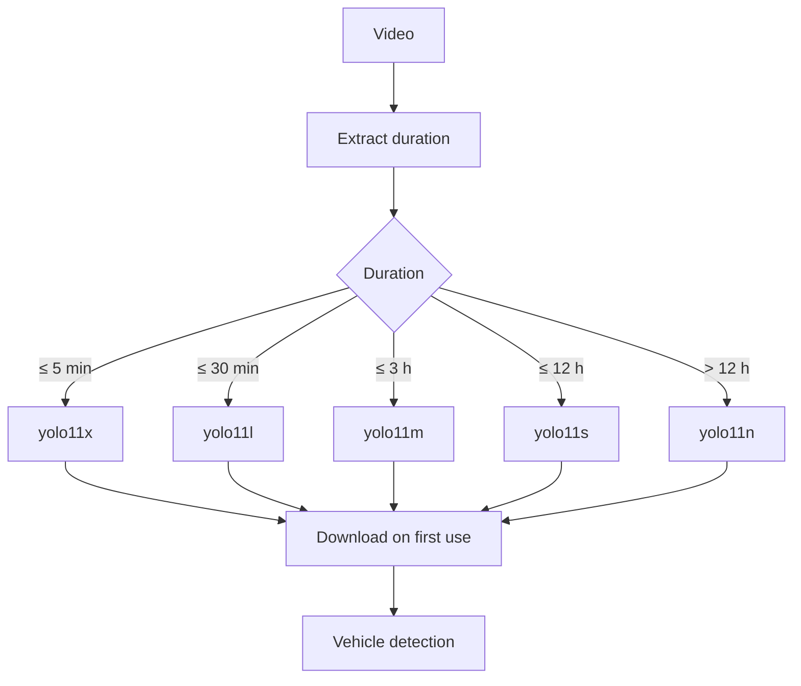

# Selección adaptativa de YOLO 11

La duración proviene del nombre estándar o, para nombres libres, de metadata OpenCV. Los umbrales se definen únicamente en `vaaet.settings.YOLO_MODEL_VARIANTS`.

No se versionan pesos `.pt` y no se prometen FPS concretos: dependen de GPU, resolución y carga del runtime.
