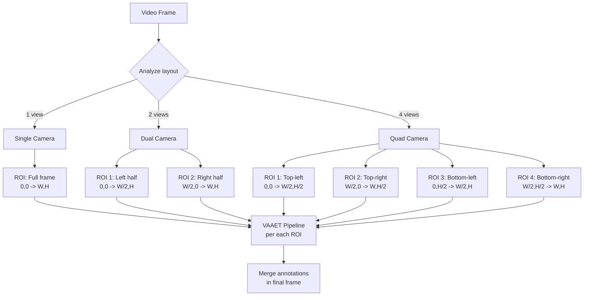
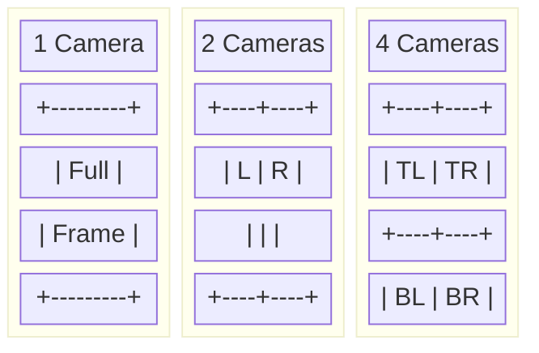

<!-- context: VAAET/docs/diagrams/multi-camera-layout.md — Multi-camera layout detection.
Referenced by SAD.md, PRD.md. -->

# Multi-Camera Layout Detection

The system auto-detects whether the video contains 1, 2, or 4 camera views and processes each ROI independently.

## Visual Layouts

## Notes

- Layout detection is based on edge analysis and black areas between views
- Each ROI is processed independently with its own tracking instance
- Perspectives can vary between cameras — homographies are applied per ROI
- Aggregated metrics (average speed, counts) combine data from all ROIs
