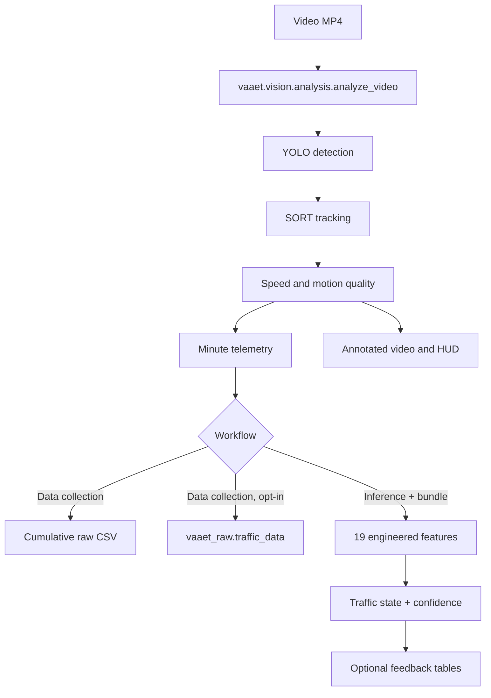

# Flujo de procesamiento de VAAET

Sin proveedor de clasificación, el HUD indica **Telemetry Collection**. Con un
proveedor validado, muestra el estado actual sin acoplar visión con TensorFlow.

La implementación interna aplica estos pasos como Pipe-and-Filter síncrono y
ordenado: `FramePacket → PerceptionPacket → TrackingPacket → MotionPacket →
RenderedFramePacket`. No usa Producer–Consumer, threads ni colas. Si una
medición futura detecta que la preparación de frames limita a un único YOLO GPU,
la única frontera candidata será lectura/preparación ordenada → cola local
acotada → detección, seguida de una restauración estricta del orden antes de
tracking, velocidad, telemetría o render.
