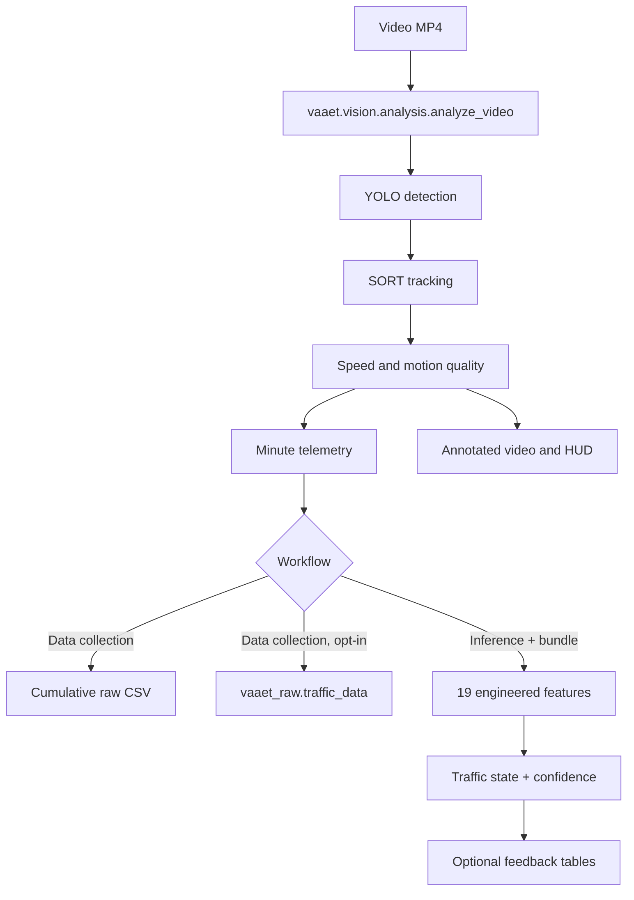

# Flujo de procesamiento de VAAET

```mermaid
flowchart TD
    V["Video MP4"] --> A["vaaet.vision.analysis.analyze_video"]
    A --> D["YOLO detection"]
    D --> T["SORT tracking"]
    T --> S["Speed and motion quality"]
    S --> M["Minute telemetry"]
    S --> H["Annotated video and HUD"]
    M --> C{"Workflow"}
    C -->|"Data collection"| CSV["Cumulative raw CSV"]
    C -->|"Data collection, opt-in"| RAW["vaaet_raw.traffic_data"]
    C -->|"Inference + bundle"| F["19 engineered features"]
    F --> P["Traffic state + confidence"]
    P --> DB["Optional feedback tables"]
```

Sin proveedor de clasificación, el HUD indica **Telemetry Collection**. Con un
proveedor validado, muestra el estado actual sin acoplar visión con TensorFlow.
