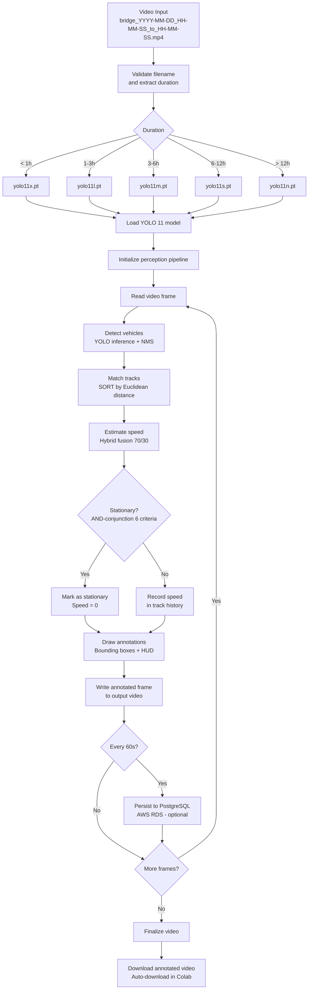

<!-- context: VAAET/docs/diagrams/pipeline-flow.md — Main processing pipeline diagram.
Referenced by SAD.md, AGENTS.md, llms-full.txt. -->

# VAAET Processing Pipeline

Complete data flow from video ingestion to annotated output and persistence.

