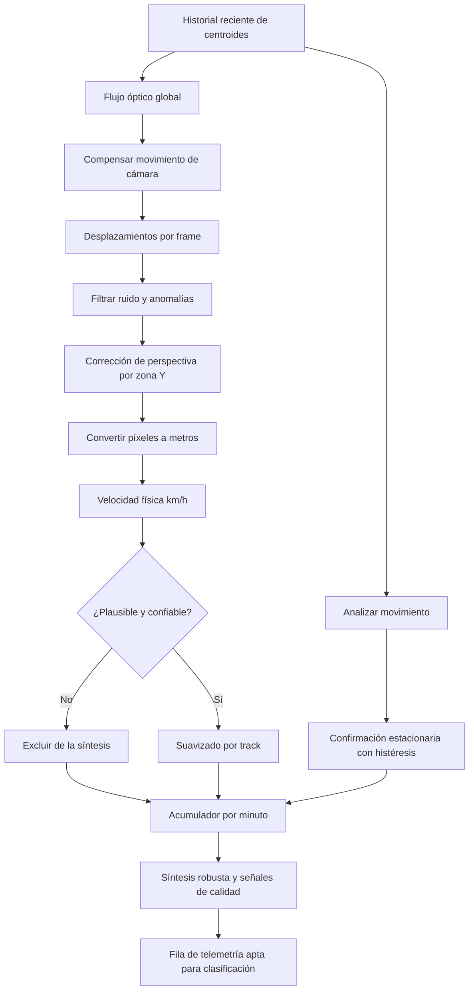

<!-- context: VAAET/docs/architecture/diagrams/speed-calculation.md — Flujo vigente de velocidad physics-first. -->

# Flujo de cálculo de velocidad physics-first

`vaaet-core/src/vaaet/vision/pipeline.py` coordina el análisis ordenado; la
estimación vive en `vaaet-core/src/vaaet/vision/speed.py`. El resultado depende
del historial de cada track y no ofrece un fallback de velocidad inventada.

La fusión MLP de velocidad es un path dormido y no integra el runtime activo.
