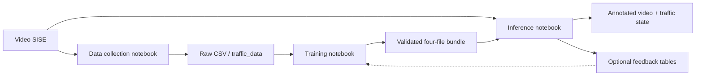

# Arquitectura de software — VAAET ML 4.0.0

VAAET ML es un pipeline MLOps batch con adquisición bajo demanda, entrenamiento, inferencia y feedback. Colab orquesta ejecuciones manuales; el paquete `vaaet` concentra lógica comprobable y `pyproject.toml` es la única fuente de dependencias.

## Capas

| Capa | Ruta | Responsabilidad |
|---|---|---|
| Orquestación | `notebooks/` | UI Colab, selección de entradas y descargas |
| Visión | `src/vaaet/vision/` | YOLO, tracking, flujo óptico, velocidad, HUD y telemetría |
| Features | `src/vaaet/features/` | 19 features, etiquetas y datos sintéticos trazables |
| Inferencia | `src/vaaet/inference/` | Clasificación tabular y gate de accidentes |
| Datos | `src/vaaet/data/` | CSV, PostgreSQL y persistencia idempotente |
| Contratos | `contracts.py`, `artifacts.py` | Esquemas y bundle portable |
| Evaluación | `src/vaaet/evaluation/` | Calibración y reporting |

`vaaet.vision.analysis.analyze_video()` es el límite común entre adquisición e inferencia. Sin proveedor de predicción muestra “Telemetry Collection”; con proveedor incorpora estado y confianza. El módulo no importa TensorFlow.

## Integraciones

- PostgreSQL es opcional. `traffic_data` conserva telemetría cruda; `telemetry_raw` y `traffic_classifications` soportan inferencia y feedback.
- Google Drive transporta el bundle completo entre sesiones Colab.
- DVC versiona el directorio `artifacts/traffic-state` como una unidad.
- Los pesos YOLO se descargan en runtime y no pertenecen al repositorio.
- La futura Web App vive en otro repositorio y sólo acepta bundles que validan el manifiesto.

## Calidad

GitHub Actions cubre Python 3.10–3.12, instalación de todos los extras, `pip check`, smoke imports, Ruff, pytest, compilación de tres notebooks, enlaces, DVC y ausencia de binarios ML en Git. GPU, Drive, videos reales y PostgreSQL se validan manualmente en Colab.

Decisiones principales: [ADR-0009](decisions/0009-modular-three-stage-architecture.md), [ADR-0010](decisions/0010-mlops-pipeline-19-features.md), [ADR-0012](decisions/0012-ml-web-boundary-and-artifact-contract.md) y [ADR-0013](decisions/0013-on-demand-data-collection-workflow.md).

Los diagramas complementarios están en el [índice de diagramas](diagrams/index.md).
