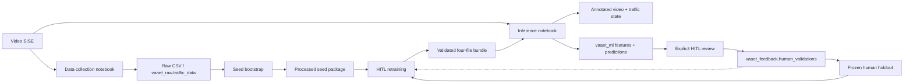

# Arquitectura de software — VAAET

VAAET separa un core operativo portable de un laboratorio MLOps batch. Colab
orquesta ejecuciones manuales; `vaaet-core` expone `vaaet` y `vaaet-ml` expone
`vaaet_ml` para datos, entrenamiento, evaluación y notebooks.

## Capas

| Capa | Ruta | Responsabilidad |
|---|---|---|
| Orquestación | `vaaet-ml/notebooks/` | UI Colab, selección de entradas y descargas |
| Core operativo | `vaaet-core/src/vaaet/` | Visión, telemetría, 19 features, estados, contratos e inferencia manifest-first |
| Datos de laboratorio | `vaaet-ml/src/vaaet_ml/data/` | CSV, PostgreSQL, snapshots, catálogo HITL e input locks |
| Evaluación | `vaaet-ml/src/vaaet_ml/evaluation/` | Comparación, drift y reporting |
| Entrenamiento | `vaaet-ml/src/vaaet_ml/training/` | Modos seed/HITL, memoria proxy, holdout y balanceo |
| Features sintéticas | `vaaet-ml/src/vaaet_ml/features/` | Datos trazables exclusivamente de entrenamiento |

`vaaet.vision.analysis.analyze_video()` es el límite común entre adquisición e
inferencia. `TrafficStateEngine` encapsula la clasificación por minuto sobre un
bundle ya validado; no implementa I/O remoto, colas ni persistencia. Sin
proveedor de predicción muestra “Telemetry Collection”; con proveedor incorpora
estado y confianza. El módulo no importa TensorFlow.

Internamente, visión ejecuta filtros síncronos y ordenados:
`FramePacket → PerceptionPacket → TrackingPacket → MotionPacket → RenderedFramePacket`.
Una sesión por clip conserva el estado de flujo óptico, SORT, velocidad,
estacionario y telemetría; no hay colas ni workers entre filtros. Una cola local
acotada entre lectura y YOLO sólo será candidata tras comparar estas métricas
base con el mismo clip, GPU, modelo y resolución, sin alterar el orden ni la
telemetría.

`VideoAnalysisResult.metrics` expone `PipelineMetrics` inmutable: frames
procesados, tiempo total, FPS end-to-end y acumulados por etapa con reloj
monotónico. El core no mide RAM ni VRAM; cualquier benchmark de Colab debe
registrarlas fuera del contrato portable.

El notebook de entrenamiento expone dos entradas explícitas que convergen antes
del split: `SEED_BOOTSTRAP` calcula features desde raw y produce un piloto;
`HITL_RETRAINING` consume el snapshot semilla vigente y todos los paquetes activos
del catálogo HITL sin recalcular features. Antes del bundle registra la selección
exacta en un input lock. El mismo `input_policy` del manifiesto se usa en serving.

## Integraciones

- PostgreSQL es opcional y portable entre proveedores. `vaaet_raw`, `vaaet_ml` y `vaaet_feedback` separan adquisición, inferencia y ground truth; `vaaet_ops` registra ejecuciones redactadas y cuatro perfiles aplican mínimo privilegio.
- Google Drive transporta el bundle y conserva semilla, sesiones HITL, input locks y holdouts humanos entre sesiones Colab.
- DVC versiona el directorio `vaaet-ml/artifacts/traffic-state` como una unidad;
  Git identifica cada versión por commit o tag y cada entorno configura su
  remoto lógico `vaaet-registry` sin versionar proveedor ni credenciales.
- Los pesos YOLO se descargan en runtime y no pertenecen al repositorio.
- La futura Web App vivirá en `vaaet-app/`, consumirá únicamente una API
  versionada y nunca accederá directamente a bundles, DVC, Drive, PostgreSQL ni
  módulos Python. Los workers de API usarán `vaaet-core`; el adaptador API será
  dueño de trabajos asíncronos, storage y persistencia.

## Calidad

GitHub Actions cubre Python 3.10–3.13, instalación de los extras declarados,
`pip check`, smoke imports, Ruff, pytest, compilación de los cuatro notebooks,
enlaces, DVC y ausencia de binarios ML en Git. GPU, Drive, videos reales y
PostgreSQL se validan manualmente en Colab.

Decisiones principales: [ADR-0009](decisions/0009-modular-three-stage-architecture.md), [ADR-0010](decisions/0010-mlops-pipeline-19-features.md), [ADR-0013](decisions/0013-on-demand-data-collection-workflow.md), [ADR-0014](decisions/0014-hierarchical-traffic-state-and-incident-policy.md), [ADR-0015](decisions/0015-postgresql-namespaces-security-and-hitl.md), [ADR-0016](decisions/0016-postgresql-hardening-and-pipeline-runs.md), [ADR-0017](decisions/0017-seed-bootstrap-and-hitl-retraining.md), [ADR-0018](decisions/0018-versioned-frozen-human-holdouts.md), [ADR-0019](decisions/0019-immutable-seed-and-hitl-datasets.md), [ADR-0021](decisions/0021-portable-core-and-ml-laboratory-boundary.md) y [ADR-0023](decisions/0023-provider-neutral-dvc-registry.md).

Los diagramas complementarios están en el [índice de diagramas](diagrams/index.md).
