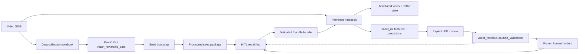

# Arquitectura de software — VAAET ML 4.5.2

VAAET ML es un pipeline MLOps batch con adquisición bajo demanda, entrenamiento, inferencia y feedback. Colab orquesta ejecuciones manuales; el paquete `vaaet` concentra lógica comprobable y `pyproject.toml` es la única fuente de dependencias.

## Capas

| Capa | Ruta | Responsabilidad |
|---|---|---|
| Orquestación | `notebooks/` | UI Colab, selección de entradas y descargas |
| Visión | `src/vaaet/vision/` | YOLO, tracking, flujo óptico, velocidad, HUD y telemetría |
| Features | `src/vaaet/features/` | 19 features, etiquetas y datos sintéticos trazables |
| Inferencia | `src/vaaet/inference/` | MLP de tres estados, histéresis y candidato conservador de incidente |
| Datos | `src/vaaet/data/` | CSV, PostgreSQL, snapshots, catálogo HITL e input locks |
| Contratos | `contracts.py`, `artifacts.py` | Esquemas y bundle portable |
| Evaluación | `src/vaaet/evaluation/` | Calibración y reporting |
| Entrenamiento | `src/vaaet/training/` | Modos seed/HITL, memoria proxy, holdout versionado y balanceo conservador |

`vaaet.vision.analysis.analyze_video()` es el límite común entre adquisición e inferencia. Sin proveedor de predicción muestra “Telemetry Collection”; con proveedor incorpora estado y confianza. El módulo no importa TensorFlow.

El notebook de entrenamiento expone dos entradas explícitas que convergen antes
del split: `SEED_BOOTSTRAP` calcula features desde raw y produce un piloto;
`HITL_RETRAINING` consume el snapshot semilla vigente y todos los paquetes activos
del catálogo HITL sin recalcular features. Antes del bundle registra la selección
exacta en un input lock. El mismo `input_policy` del manifiesto se usa en serving.

## Integraciones

- PostgreSQL es opcional y portable entre proveedores. `vaaet_raw`, `vaaet_ml` y `vaaet_feedback` separan adquisición, inferencia y ground truth; `vaaet_ops` registra ejecuciones redactadas y cuatro perfiles aplican mínimo privilegio.
- Google Drive transporta el bundle y conserva semilla, sesiones HITL, input locks y holdouts humanos entre sesiones Colab.
- DVC versiona el directorio `artifacts/traffic-state` como una unidad.
- Los pesos YOLO se descargan en runtime y no pertenecen al repositorio.
- La futura Web App vive en otro repositorio y sólo acepta bundles que validan el manifiesto.

## Calidad

GitHub Actions cubre Python 3.10–3.12, instalación de todos los extras, `pip check`, smoke imports, Ruff, pytest, compilación de tres notebooks, enlaces, DVC y ausencia de binarios ML en Git. GPU, Drive, videos reales y PostgreSQL se validan manualmente en Colab.

Decisiones principales: [ADR-0009](decisions/0009-modular-three-stage-architecture.md), [ADR-0010](decisions/0010-mlops-pipeline-19-features.md), [ADR-0012](decisions/0012-ml-web-boundary-and-artifact-contract.md), [ADR-0013](decisions/0013-on-demand-data-collection-workflow.md), [ADR-0014](decisions/0014-hierarchical-traffic-state-and-incident-policy.md), [ADR-0015](decisions/0015-postgresql-namespaces-security-and-hitl.md), [ADR-0016](decisions/0016-postgresql-hardening-and-pipeline-runs.md), [ADR-0017](decisions/0017-seed-bootstrap-and-hitl-retraining.md), [ADR-0018](decisions/0018-versioned-frozen-human-holdouts.md) y [ADR-0019](decisions/0019-immutable-seed-and-hitl-datasets.md).

Los diagramas complementarios están en el [índice de diagramas](diagrams/index.md).
