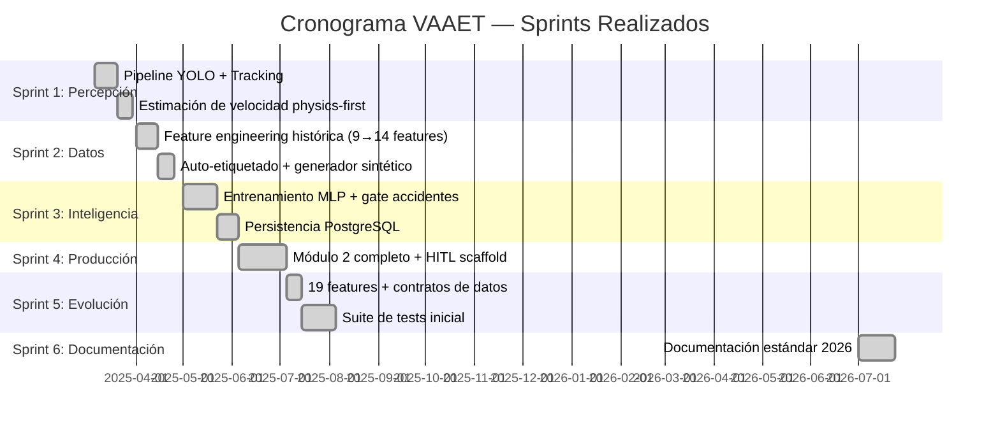

<!-- context: VAAET/docs/governance/project-plan.md — Plan de gestión del proyecto.
Complementa SOW.md y RISK_MATRIX.md. -->

# Plan de Gestión del Proyecto — VAAET

## Identificación del Proyecto

| Campo | Detalles |
|---|---|
| **Nombre del Proyecto** | VAAET — Video Advanced Analysis of Traffic |
| **Versión** | 4.5.0 |
| **Estado** | Aprobado |
| **Responsable Técnico** | Facundo Nicolás González |
| **Última Revisión** | 2026-07-23 |

---

## 1. Alcance del Proyecto

VAEET cubre el ciclo completo de análisis vehicular: percepción (YOLO 11 + SORT), inteligencia (MLP clasificador de 4 estados), y persistencia (PostgreSQL). El alcance actual se limita al Puente Gral. Manuel Belgrano.

### 1.1 Hitos Principales

| Hito | Descripción | Fecha | Estado |
|---|---|---|---|
| M1 | Pipeline de percepción (YOLO + SORT + velocidad) | 2025-03-15 | ✅ |
| M2 | Clasificador MLP + auto-etiquetado | 2025-07-14 | ✅ |
| M3 | Persistencia PostgreSQL + upsert | 2025-07-14 | ✅ |
| M4 | Suite de tests (ampliada a 20 archivos en 4.0.0) | 2026-06-30 | ✅ |
| M5 | Documentación estándar 2026 | 2026-07-23 | ✅ |
| M6 | Web App MVP | TBD | 📋 |

---

## 2. Ciclo de Vida del Proyecto

### 1.1 Metodología

VAAET utiliza un ciclo de vida **incremental e iterativo** adaptado para un desarrollador único:

- **Iterativo**: Cada módulo se construye en sprints de 2-4 semanas
- **Incremental**: Cada módulo añade capacidades sobre los anteriores
- **Documentación continua**: Los documentos se actualizan en cada iteración

### 1.2 Sprints Completados

---

## 2. Roles y Responsabilidades (RACI)

| Tarea | Facundo González |
|---|---|
| Diseño de arquitectura | **R** (Responsable) |
| Implementación de código | **R** |
| Testing y QA | **R** |
| Documentación | **R** |
| Revisión de ADRs | **R** |
| Calibración del puente | **R** |
| Acceso a datos SISE | **C** (Consulta) |
| Gestión de infraestructura AWS | **R** |

---

## 3. Gestión de la Configuración

### 3.1 Control de Versiones

| Aspecto | Política |
|---|---|
| **Sistema** | Git + GitHub |
| **Rama principal** | `main` |
| **Ramas de feature** | `feature/*` |
| **Convención de commits** | Conventional Commits (`feat:`, `fix:`, `docs:`, `refactor:`) |
| **Versionado** | SemVer (4.5.0 actual) |

### 3.2 Artefactos Versionados

| Artefacto | Formato | Versionado |
|---|---|---|
| Código fuente | Git | SemVer |
| Modelo MLP | `.keras` | `MODEL_VERSION` en `config.py` |
| Scaler | `.joblib` | Acompaña al modelo |
| Documentación | Markdown | Fecha de revisión en cada documento |

---

## 4. Gestión de la Calidad

| Actividad | Herramienta | Frecuencia |
|---|---|---|
| Tests unitarios | pytest | Cada commit (CI) |
| Compilación de notebooks | ast.parse() | Cada commit (CI) |
| Verificación de enlaces | Script CI | Cada commit (CI) |
| Validación E2E en Colab | Manual | Antes de cada release |
| Auditoría de dependencias | pip audit | Mensual |
| Revisión de documentación | Manual | Trimestral |

---

## 5. Gestión de Comunicación

| Evento | Frecuencia | Medio | Participantes |
|---|---|---|---|
| Actualización de CHANGELOG | Por release | GitHub | Público |
| Actualización de ADRs | Por decisión arquitectónica | Repositorio | Desarrollador + IAs |
| Issues/Bugs | Según ocurrencia | GitHub Issues | Público |
| Discusión técnica | Según necesidad | GitHub Discussions | Público |

---

## 6. Próximos Pasos (Roadmap)

| Prioridad | Tarea | Estimación | Dependencias |
|---|---|---|---|
| P0 | Validación E2E completa en Colab | 1 semana | Módulos 1 y 2 estables |
| P1 | Implementar Model Registry con DVC | 2 semanas | `pyproject.toml` listo |
| P1 | Publicación académica | 4 semanas | Datos suficientes |
| P2 | Web App MVP (dashboard) | 8 semanas | Modelo estable |
| P2 | API REST para integración | 4 semanas | Web App MVP |
| P3 | Expansión a otros puentes | 12 semanas | Web App + API |

---

Responsable del documento: Facundo Nicolás González
Fecha de revisión: 2026-07-23
