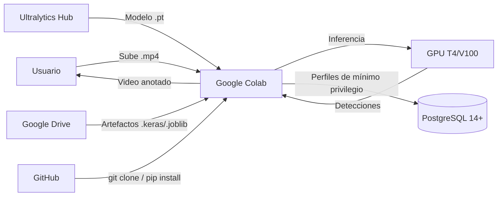

<!-- context: VAAET/docs/operations/deployment.md — Manual de despliegue.
Complementa USER_GUIDE.md y SAD.md. -->

# Manual de Despliegue (DevOps Playbook) — VAAET

## Identificación del Proyecto

| Campo | Detalles |
|---|---|
| **Nombre del Proyecto** | VAAET — Video Advanced Analysis of Traffic |
| **Versión** | 4.1.0 |
| **Estado** | Aprobado |
| **Responsable Técnico** | Facundo Nicolás González |
| **Última Revisión** | 2026-07-23 |

---

## 1. Arquitectura de Infraestructura

VAAET opera en un modelo "Notebook-as-Runtime": Google Colab es el entorno de
ejecución, cualquier proveedor PostgreSQL 14+ compatible puede proveer
persistencia opcional y Google Drive transporta artefactos.

### 1.1 Componentes del Sistema

| Componente | Tecnología | Responsabilidad |
|---|---|---|
| **Runtime** | Google Colab Free/Pro | Ejecución de notebooks con GPU T4/V100 |
| **Código fuente** | GitHub | Versionado y CI/CD |
| **Base de datos** | PostgreSQL 14+ compatible | Raw, features, predicciones y HITL (opcional) |
| **Almacenamiento de modelos** | Google Drive / local | Artefactos `.keras` y `.joblib` |
| **Almacenamiento de video** | Local / Colab temporal | Videos de entrada y salida |

### 1.2 Diagrama de Infraestructura

---

## 2. Entornos de Ciclo de Vida

| Entorno | Plataforma | Propósito | Datos |
|---|---|---|---|
| **Desarrollo local** | Python 3.10–3.12 | Desarrollo y testing de `src/vaaet/` | Datos sintéticos, sin GPU |
| **Google Colab** | Colab Free/Pro | Ejecución de notebooks (entorno principal) | Videos reales, GPU disponible |
| **CI** | GitHub Actions + PostgreSQL 17 | Validación automática | Tests puros y migración/grants reales, sin GPU |

---

## 3. Pipeline de CI/CD

### 3.1 Integración Continua (CI)

Se activa mediante **push** o **pull request** a `main`.

Pipeline definido en `.github/workflows/ci.yml`:

1. **Instalación**: `pip install -e ".[vision,training,visualization,database,dev]"`
2. **Consistencia**: `pip check` y smoke imports
3. **Calidad**: Ruff y `pytest tests/ -v --tb=short`
4. **Notebooks**: compilación de adquisición, entrenamiento e inferencia
5. **Repositorio**: enlaces, DVC y ausencia de binarios ML en Git

### 3.2 Despliegue (Manual)

VAAET no tiene despliegue automatizado porque el runtime es Google Colab. El "despliegue" consiste en:

1. El usuario abre el notebook en Colab desde GitHub
2. La primera celda clona o actualiza el repo, instala una vez y ejecuta `pip check`
3. Entrenamiento genera el bundle; inferencia lo valida antes de cargarlo

Ver la [guía de Colab](colab-guide.md) para Secrets, Drive y recuperación ante reinicios.

---

## 4. Procedimiento de Setup en Google Colab

### Primera celda — Setup del entorno

Ejecutá la primera celda del notebook sin añadir comandos manuales. Esta clona o
actualiza `/content/vaaet`, instala un wheel local con los extras del workflow,
limpia imports anteriores y valida que `vaaet` provenga del paquete instalado.
El modo editable se reserva para desarrollo local.

### Configuración de BD (opcional)

Definí el endpoint `VAAET_DB_*` y la credencial específica de cada perfil en
Colab Secrets, según la [guía de Colab](colab-guide.md). No uses `getpass`, celdas
con `os.environ` ni un usuario compartido. El administrador aplica Alembic y
grants fuera de Colab.

---

## 5. Gestión de Secretos

| Secreto | Mecanismo | Ubicación |
|---|---|---|
| Credenciales de BD | Colab Secrets por perfil | Runtime de Colab |
| Token de GitHub | Configuración de Colab | Secrets de Colab |

**Está estrictamente prohibido:**
- Hardcodear credenciales en código
- Imprimir credenciales en outputs de celdas
- Commitear archivos `.env` al repositorio

---

## 6. Estrategia de Base de Datos

### Migraciones

Alembic es la única autoridad DDL. Ejecutá `alembic upgrade head` con el perfil
administrador y después `migrations/provision-roles.sql`. Los notebooks sólo
comprueban el contrato y fallan con un mensaje claro si la migración falta.

### Backups

- Backup administrativo de los schemas `vaaet_raw`, `vaaet_ml` y `vaaet_feedback`
- Script de conversión: `scripts/convert-postgres-backup.py`
- Configurar backups automáticos, retención y restauraciones probadas en el proveedor

---

## 7. Monitoreo y Resolución de Problemas

### Indicadores de Salud

| Indicador | Rango Normal | Acción si Anormal |
|---|---|---|
| `speed_measurement_quality` | > 0.70 | Revisar calidad del video, verificar flujo óptico |
| `rejected_speed_count` por minuto | < 30% del total | Verificar calibración de `pixels_per_meter` |
| F1-macro del clasificador | ≥ 0.85 | Re-entrenar con datos nuevos |

### Procedimiento de Rollback

En caso de error en los artefactos del modelo:
1. Restaurar artefactos previos desde Google Drive
2. Verificar F1-macro con el dataset de test
3. Si no hay backup, re-ejecutar el workflow de entrenamiento completo

---

## 8. Checklist de Despliegue

- [ ] Tests pasan en CI (`pytest tests/ -v`)
- [ ] Notebooks compilan sin errores de sintaxis
- [ ] Artefactos del modelo están exportados a Google Drive
- [ ] Variables de entorno de BD documentadas en `.env.example`
- [ ] CHANGELOG actualizado con cambios de la versión
- [ ] Documentación actualizada si hay cambios en features o flujo

---

Responsable del documento: Facundo Nicolás González
Fecha de revisión: 2026-07-23
