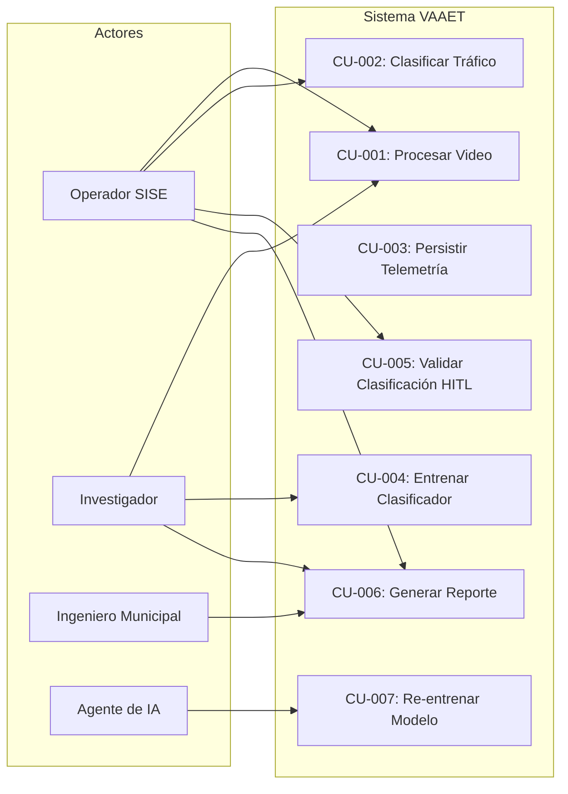

<!-- context: VAAET/docs/product/use-cases.md — Casos de uso del negocio.
Complementa PRD.md, SRS.md y USER_PERSONAS.md. -->

# Casos de Uso del Negocio (CUN) — VAAET

## Identificación del Proyecto

| Campo | Detalles |
|---|---|
| **Nombre del Proyecto** | VAAET — Video Advanced Analysis of Traffic |
| **Versión** | 4.5.3 |
| **Estado** | Aprobado |
| **Responsable Técnico** | Facundo Nicolás González |
| **Última Revisión** | 2026-07-23 |

---

## Diagrama General de Casos de Uso

---

## Caso de Uso CU-001: Procesar Video de Tráfico

| Campo | Detalle |
|---|---|
| **Actor principal** | Operador SISE / Investigador |
| **Precondición** | Video en formato `bridge_YYYY-MM-DD_HH-MM-SS_to_HH-MM-SS.mp4` disponible |
| **Postcondición** | DataFrame de telemetría con 9 campos crudos por minuto + video anotado (opcional) |
| **Prioridad** | P0 — Crítico |

| Paso | Acción del Actor | Respuesta del Sistema |
|---|---|---|
| 1 | Sube archivo .mp4 a Colab | Extrae duración y procedencia temporal disponible |
| 2 | — | Selecciona variante YOLO según duración |
| 3 | — | Procesa frame por frame: detección → tracking → velocidad |
| 4 | — | Agrega telemetría por minuto (conteos, velocidad promedio, señales de calidad) |
| 5 | Descarga video anotado (opcional) | Genera video con bounding boxes, tipos, velocidades y HUD |

**Flujo alternativo:**
- **1a.** Nombre libre → continúa con hora de procesamiento y advertencia de trazabilidad
- **3a.** Frame corrupto → Skip al siguiente frame
- **3b.** Sin detecciones → Usar promedios históricos

---

## CU-002: Clasificar Estado del Tráfico

| Campo | Detalle |
|---|---|
| **Actor principal** | Operador SISE |
| **Precondición** | Telemetría procesada (CU-001) + modelo MLP cargado |
| **Postcondición** | Cada minuto completo obtiene un estado estable; Accident requiere confirmación humana |
| **Prioridad** | P0 — Crítico |

| Paso | Acción del Actor | Respuesta del Sistema |
|---|---|---|
| 1 | Ejecuta celda de clasificación | Aplica feature engineering (9 → 19 features) |
| 2 | — | Escala features con StandardScaler cargado |
| 3 | — | Predice tres estados con MLP y calibración |
| 4 | — | Aplica umbrales, histéresis y candidato conservador de incidente |
| 5 | Revisa resultados | Muestra tabla con estado, confianza, y señales de evidencia |

---

## CU-003: Persistir Telemetría en Base de Datos

| Campo | Detalle |
|---|---|
| **Actor principal** | Sistema (automático) |
| **Precondición** | Telemetría clasificada + credenciales de BD disponibles |
| **Postcondición** | Registros en `vaaet_ml.telemetry_features` y `vaaet_ml.traffic_predictions` |
| **Prioridad** | P1 — Alto |

**Flujo alternativo:**
- Sin credenciales de BD → Degradación silenciosa, continúa sin persistencia
- Error de conexión → Log de advertencia, continúa procesamiento

---

## CU-004: Entrenar Clasificador de Tráfico

| Campo | Detalle |
|---|---|
| **Actor principal** | Investigador |
| **Precondición** | Datos raw disponibles en `vaaet_raw.traffic_data`, CSV o backup |
| **Postcondición** | Artefactos `.keras`, `.joblib` exportados a `vaaet-ml/artifacts/traffic-state/` |
| **Prioridad** | P0 — Crítico (ejecución única) |

| Paso | Acción del Actor | Respuesta del Sistema |
|---|---|---|
| 1 | Abre el notebook de entrenamiento en Colab | Ejecuta el plan de ingestión tipado |
| 2 | — | Audita telemetría v2 y conserva procedencia real/sintética |
| 3 | — | Aplica feature engineering (9 → 19 features) |
| 4 | — | Usa ground truth humano o etiquetas proxy de tres estados |
| 5 | — | Calcula class weights limitados sólo con train; sintéticos con peso reducido |
| 6 | — | Entrena MLP con EarlyStopping |
| 7 | Verifica gates de producción | Muestra coste, F1, calibración, soporte e intervalos |
| 8 | — | Exporta bundle v2 con elegibilidad y bloqueos |

---

## CU-005: Validar Clasificación (HITL)

| Campo | Detalle |
|---|---|
| **Actor principal** | Operador SISE |
| **Precondición** | Clasificación realizada (CU-002), scaffold HITL habilitado |
| **Postcondición** | Nueva fila append-only en `vaaet_feedback.human_validations` |
| **Prioridad** | P2 — Medio (experimental) |
| **Estado** | Scaffold experimental, no flujo productivo validado |

---

## CU-006: Generar Reporte de Tráfico

| Campo | Detalle |
|---|---|
| **Actor principal** | Operador SISE / Investigador / Ingeniero Municipal |
| **Precondición** | Telemetría clasificada disponible |
| **Postcondición** | Dashboard visual con gráficos de tendencias, conteos por tipo, estados del tráfico |
| **Prioridad** | P1 — Alto |

---

## CU-007: Re-entrenar Modelo (Bucle CT)

| Campo | Detalle |
|---|---|
| **Actor principal** | Sistema / Investigador |
| **Precondición** | Suficientes registros HITL validados acumulados |
| **Postcondición** | Nuevo artefacto `.keras` con F1-macro mejorado |
| **Prioridad** | P2 — Medio |
| **Estado** | Scaffold experimental en el workflow de inferencia |

---

Responsable del documento: Facundo Nicolás González
Fecha de revisión: 2026-07-23
